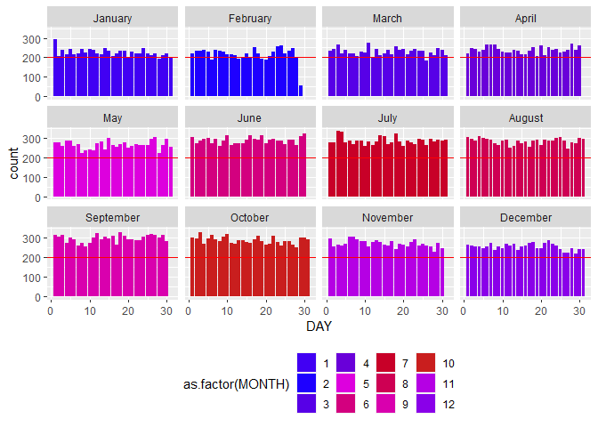
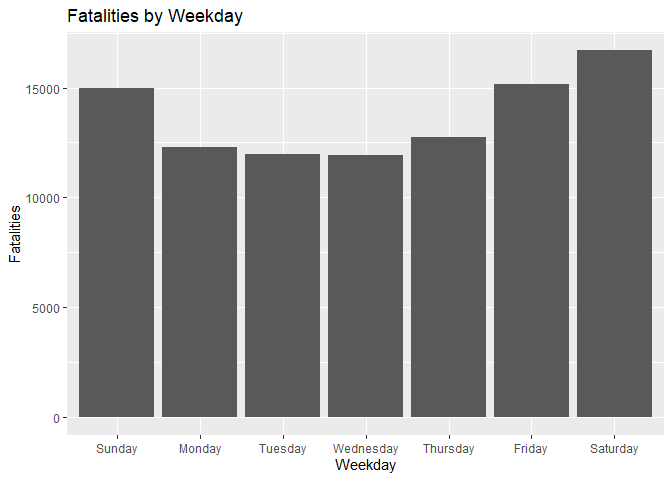
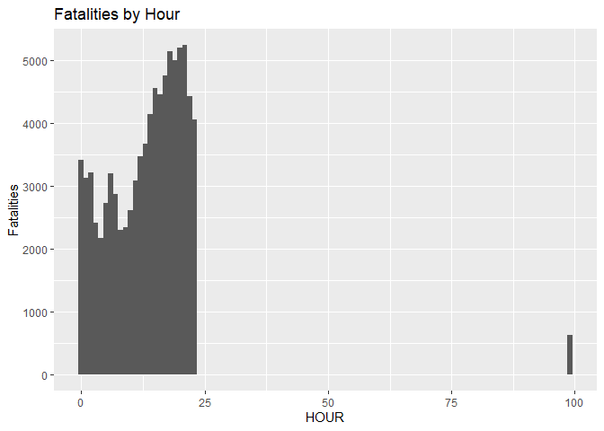
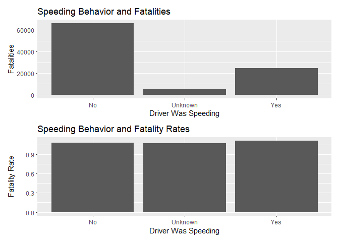
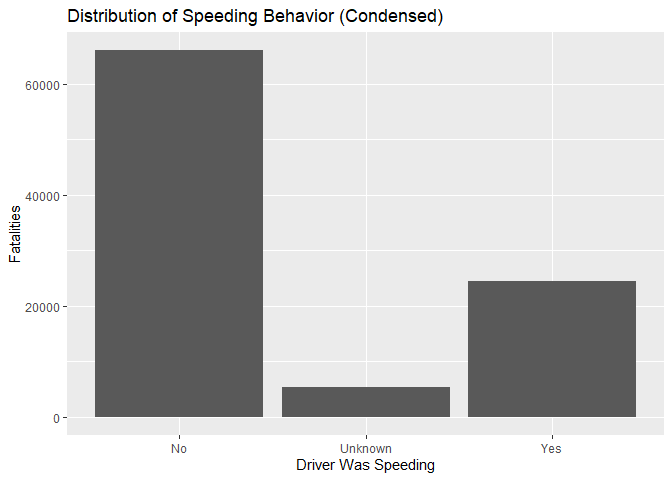
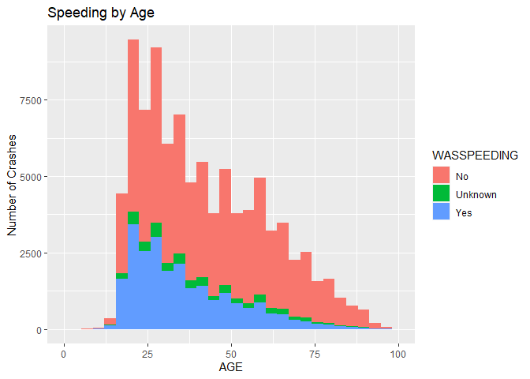

# Final Project DS202

## Marissa Baietto, Ryan Dorle, Braeden Collings

Here is the link to all of the csv files we used:
<https://www.nhtsa.gov/file-downloads?p=nhtsa/downloads/FARS/>

Importing the accident datasets.

``` r
library(readr)
accident_2017 <- read_csv("2017.csv")
```

    ## Rows: 34560 Columns: 91
    ## ── Column specification ────────────────────────────────────────────────────────
    ## Delimiter: ","
    ## chr (41): STATENAME, COUNTYNAME, CITYNAME, MONTHNAME, DAY_WEEKNAME, HOURNAME...
    ## dbl (50): STATE, ST_CASE, VE_TOTAL, VE_FORMS, PVH_INVL, PEDS, PERSONS, PERMV...
    ## 
    ## ℹ Use `spec()` to retrieve the full column specification for this data.
    ## ℹ Specify the column types or set `show_col_types = FALSE` to quiet this message.

``` r
accident_2018 <- read_csv("2018.csv")
```

    ## Rows: 33919 Columns: 91
    ## ── Column specification ────────────────────────────────────────────────────────
    ## Delimiter: ","
    ## chr (41): STATENAME, COUNTYNAME, CITYNAME, MONTHNAME, DAY_WEEKNAME, HOURNAME...
    ## dbl (50): STATE, ST_CASE, VE_TOTAL, VE_FORMS, PVH_INVL, PEDS, PERSONS, PERMV...
    ## 
    ## ℹ Use `spec()` to retrieve the full column specification for this data.
    ## ℹ Specify the column types or set `show_col_types = FALSE` to quiet this message.

``` r
accident_2019 <- read_csv("2019.csv")
```

    ## Rows: 33487 Columns: 91
    ## ── Column specification ────────────────────────────────────────────────────────
    ## Delimiter: ","
    ## chr (41): STATENAME, COUNTYNAME, CITYNAME, MONTHNAME, DAY_WEEKNAME, HOURNAME...
    ## dbl (50): STATE, ST_CASE, VE_TOTAL, VE_FORMS, PVH_INVL, PEDS, PERSONS, PERMV...
    ## 
    ## ℹ Use `spec()` to retrieve the full column specification for this data.
    ## ℹ Specify the column types or set `show_col_types = FALSE` to quiet this message.

``` r
accident_2020 <- read_csv("2020.csv")
```

    ## Rows: 35935 Columns: 81
    ## ── Column specification ────────────────────────────────────────────────────────
    ## Delimiter: ","
    ## chr (34): STATENAME, COUNTYNAME, CITYNAME, MONTHNAME, DAY_WEEKNAME, HOURNAME...
    ## dbl (47): STATE, ST_CASE, VE_TOTAL, VE_FORMS, PVH_INVL, PEDS, PERNOTMVIT, PE...
    ## 
    ## ℹ Use `spec()` to retrieve the full column specification for this data.
    ## ℹ Specify the column types or set `show_col_types = FALSE` to quiet this message.

``` r
accident_2021 <- read_csv("2021.csv")
```

    ## Rows: 39508 Columns: 80
    ## ── Column specification ────────────────────────────────────────────────────────
    ## Delimiter: ","
    ## chr (34): STATENAME, COUNTYNAME, CITYNAME, MONTHNAME, DAY_WEEKNAME, HOURNAME...
    ## dbl (46): STATE, ST_CASE, PEDS, PERNOTMVIT, VE_TOTAL, VE_FORMS, PVH_INVL, PE...
    ## 
    ## ℹ Use `spec()` to retrieve the full column specification for this data.
    ## ℹ Specify the column types or set `show_col_types = FALSE` to quiet this message.

``` r
library(tidyverse)
```

    ## ── Attaching core tidyverse packages ──────────────────────── tidyverse 2.0.0 ──
    ## ✔ dplyr     1.1.2     ✔ purrr     1.0.2
    ## ✔ forcats   1.0.0     ✔ stringr   1.5.0
    ## ✔ ggplot2   3.4.3     ✔ tibble    3.2.1
    ## ✔ lubridate 1.9.2     ✔ tidyr     1.3.0
    ## ── Conflicts ────────────────────────────────────────── tidyverse_conflicts() ──
    ## ✖ dplyr::filter() masks stats::filter()
    ## ✖ dplyr::lag()    masks stats::lag()
    ## ℹ Use the conflicted package (<http://conflicted.r-lib.org/>) to force all conflicts to become errors

Selecting the variables we need.

``` r
accident_2017 <- accident_2017 %>% select(STATENAME, ST_CASE, MONTH, DAY, YEAR, HOUR, MINUTE, RUR_URBNAME, LATITUDE, LONGITUD, LGT_CONDNAME, WEATHER1NAME, FATALS, DRUNK_DR)
accident_2018 <- accident_2018 %>% select(STATENAME, ST_CASE, MONTH, DAY, YEAR, HOUR, MINUTE, RUR_URBNAME, LATITUDE, LONGITUD, LGT_CONDNAME, WEATHER1NAME, FATALS, DRUNK_DR)
accident_2019 <- accident_2019 %>% select(STATENAME, ST_CASE, MONTH, DAY, YEAR, HOUR, MINUTE, RUR_URBNAME, LATITUDE, LONGITUD, LGT_CONDNAME, WEATHER1NAME, FATALS, DRUNK_DR)
accident_2020 <- accident_2020 %>% select(STATENAME, ST_CASE, MONTH, DAY, YEAR, HOUR, MINUTE, RUR_URBNAME, LATITUDE, LONGITUD, LGT_CONDNAME, WEATHERNAME, FATALS, DRUNK_DR)
accident_2021 <- accident_2021 %>% select(STATENAME, ST_CASE, MONTH, DAY, YEAR, HOUR, MINUTE, RUR_URBNAME, LATITUDE, LONGITUD, LGT_CONDNAME, WEATHERNAME, FATALS)


accident_2017$WEATHERNAME <- accident_2017$WEATHER1NAME
accident_2018$WEATHERNAME <- accident_2018$WEATHER1NAME
accident_2019$WEATHERNAME <- accident_2019$WEATHER1NAME

accident_2017 <- accident_2017 %>% select(-WEATHER1NAME)
accident_2018 <- accident_2018 %>% select(-WEATHER1NAME)
accident_2019 <- accident_2019 %>% select(-WEATHER1NAME)
```

``` r
View(accident_2019)
```

Importing the person datasets.

``` r
person_2017 <- read_csv("2017_person.csv")
```

    ## New names:
    ## Rows: 52752 Columns: 14
    ## ── Column specification
    ## ──────────────────────────────────────────────────────── Delimiter: "," chr
    ## (9): SEXNAME, INJ_SEVNAME, REST_USENAME, EJECTIONNAME, DRINKINGNAME, DRU... dbl
    ## (5): ...1, AGE, ST_CASE, VEH_NO, PER_NO
    ## ℹ Use `spec()` to retrieve the full column specification for this data. ℹ
    ## Specify the column types or set `show_col_types = FALSE` to quiet this message.
    ## • `` -> `...1`

``` r
person_2018 <- read_csv("2018_person.csv")
```

    ## New names:
    ## Rows: 51905 Columns: 14
    ## ── Column specification
    ## ──────────────────────────────────────────────────────── Delimiter: "," chr
    ## (9): SEXNAME, INJ_SEVNAME, REST_USENAME, EJECTIONNAME, DRINKINGNAME, DRU... dbl
    ## (5): ...1, AGE, ST_CASE, VEH_NO, PER_NO
    ## ℹ Use `spec()` to retrieve the full column specification for this data. ℹ
    ## Specify the column types or set `show_col_types = FALSE` to quiet this message.
    ## • `` -> `...1`

``` r
person_2019 <- read_csv("2019_person.csv")
```

    ## New names:
    ## Rows: 51302 Columns: 14
    ## ── Column specification
    ## ──────────────────────────────────────────────────────── Delimiter: "," chr
    ## (9): SEXNAME, INJ_SEVNAME, REST_USENAME, EJECTIONNAME, DRINKINGNAME, DRU... dbl
    ## (5): ...1, AGE, ST_CASE, VEH_NO, PER_NO
    ## ℹ Use `spec()` to retrieve the full column specification for this data. ℹ
    ## Specify the column types or set `show_col_types = FALSE` to quiet this message.
    ## • `` -> `...1`

``` r
person_2020 <- read_csv("2020_person.csv")
```

    ## New names:
    ## Rows: 54165 Columns: 14
    ## ── Column specification
    ## ──────────────────────────────────────────────────────── Delimiter: "," chr
    ## (9): SEXNAME, INJ_SEVNAME, REST_USENAME, EJECTIONNAME, DRINKINGNAME, DRU... dbl
    ## (5): ...1, AGE, ST_CASE, VEH_NO, PER_NO
    ## ℹ Use `spec()` to retrieve the full column specification for this data. ℹ
    ## Specify the column types or set `show_col_types = FALSE` to quiet this message.
    ## • `` -> `...1`

``` r
person_2021 <- read_csv("2021_person.csv")
```

    ## New names:
    ## Rows: 60904 Columns: 14
    ## ── Column specification
    ## ──────────────────────────────────────────────────────── Delimiter: "," chr
    ## (9): SEXNAME, INJ_SEVNAME, REST_USENAME, EJECTIONNAME, DRINKINGNAME, DRU... dbl
    ## (5): ...1, AGE, ST_CASE, VEH_NO, PER_NO
    ## ℹ Use `spec()` to retrieve the full column specification for this data. ℹ
    ## Specify the column types or set `show_col_types = FALSE` to quiet this message.
    ## • `` -> `...1`

Selecting person variables.

``` r
person_2017 <- person_2017 %>% select(AGE, SEXNAME, DRINKINGNAME, DRUGSNAME, LAG_HRSNAME, ST_CASE, VEH_NO, PER_NO)
person_2018 <- person_2018 %>% select(AGE, SEXNAME, DRINKINGNAME, DRUGSNAME, LAG_HRSNAME, ST_CASE, VEH_NO, PER_NO)
person_2019 <- person_2019 %>% select(AGE, SEXNAME, DRINKINGNAME, DRUGSNAME, LAG_HRSNAME, ST_CASE, VEH_NO, PER_NO)
person_2020 <- person_2020 %>% select(AGE, SEXNAME, DRINKINGNAME, DRUGSNAME, LAG_HRSNAME, ST_CASE, VEH_NO, PER_NO)
person_2021 <- person_2021 %>% select(AGE, SEXNAME, DRINKINGNAME, DRUGSNAME, LAG_HRSNAME, ST_CASE, VEH_NO, PER_NO)
```

Adding year variable to the datasets.

``` r
person_2017$YEAR = 2017
person_2018$YEAR = 2018
person_2019$YEAR = 2019
person_2020$YEAR = 2020
person_2021$YEAR = 2021
```

``` r
View(person_2017)
```

Importing Vehicle Datasets

``` r
vehicle_2017 <- read_csv("2017_vehicle.csv")
```

    ## New names:
    ## Rows: 53128 Columns: 8
    ## ── Column specification
    ## ──────────────────────────────────────────────────────── Delimiter: "," chr
    ## (4): HIT_RUNNAME, NUMOCCSNAME, L_STATENAME, SPEEDRELNAME dbl (4): ...1,
    ## ST_CASE, VEH_NO, VSPD_LIM
    ## ℹ Use `spec()` to retrieve the full column specification for this data. ℹ
    ## Specify the column types or set `show_col_types = FALSE` to quiet this message.
    ## • `` -> `...1`

``` r
vehicle_2018 <- read_csv("2018_vehicle.csv")
```

    ## New names:
    ## Rows: 52286 Columns: 8
    ## ── Column specification
    ## ──────────────────────────────────────────────────────── Delimiter: "," chr
    ## (4): HIT_RUNNAME, NUMOCCSNAME, L_STATENAME, SPEEDRELNAME dbl (4): ...1,
    ## ST_CASE, VEH_NO, VSPD_LIM
    ## ℹ Use `spec()` to retrieve the full column specification for this data. ℹ
    ## Specify the column types or set `show_col_types = FALSE` to quiet this message.
    ## • `` -> `...1`

``` r
vehicle_2019 <- read_csv("2019_vehicle.csv")
```

    ## New names:
    ## Rows: 51623 Columns: 8
    ## ── Column specification
    ## ──────────────────────────────────────────────────────── Delimiter: "," chr
    ## (4): HIT_RUNNAME, NUMOCCSNAME, L_STATENAME, SPEEDRELNAME dbl (4): ...1,
    ## ST_CASE, VEH_NO, VSPD_LIM
    ## ℹ Use `spec()` to retrieve the full column specification for this data. ℹ
    ## Specify the column types or set `show_col_types = FALSE` to quiet this message.
    ## • `` -> `...1`

``` r
vehicle_2020 <- read_csv("2020_vehicle.csv")
```

    ## New names:
    ## Rows: 54552 Columns: 8
    ## ── Column specification
    ## ──────────────────────────────────────────────────────── Delimiter: "," chr
    ## (4): HIT_RUNNAME, NUMOCCSNAME, L_STATENAME, SPEEDRELNAME dbl (4): ...1,
    ## ST_CASE, VEH_NO, VSPD_LIM
    ## ℹ Use `spec()` to retrieve the full column specification for this data. ℹ
    ## Specify the column types or set `show_col_types = FALSE` to quiet this message.
    ## • `` -> `...1`

``` r
vehicle_2021 <- read_csv("2021_vehicle.csv")
```

    ## New names:
    ## Rows: 61332 Columns: 8
    ## ── Column specification
    ## ──────────────────────────────────────────────────────── Delimiter: "," chr
    ## (4): HIT_RUNNAME, NUMOCCSNAME, L_STATENAME, SPEEDRELNAME dbl (4): ...1,
    ## ST_CASE, VEH_NO, VSPD_LIM
    ## ℹ Use `spec()` to retrieve the full column specification for this data. ℹ
    ## Specify the column types or set `show_col_types = FALSE` to quiet this message.
    ## • `` -> `...1`

Adding year variable to the datasets.

``` r
vehicle_2017$YEAR = 2017
vehicle_2018$YEAR = 2018
vehicle_2019$YEAR = 2019
vehicle_2020$YEAR = 2020
vehicle_2021$YEAR = 2021
```

Merging the datasets.

``` r
df_2017 <- left_join(accident_2017, person_2017, by=c('YEAR', 'ST_CASE'))
df_2018 <- left_join(accident_2018, person_2018, by=c('YEAR', 'ST_CASE'))
df_2019 <- left_join(accident_2019, person_2019, by=c('YEAR', 'ST_CASE'))
df_2020 <- left_join(accident_2020, person_2020, by=c('YEAR', 'ST_CASE'))
df_2021 <- left_join(accident_2021, person_2021, by=c('YEAR', 'ST_CASE'))


df_2017 <- left_join(df_2017, vehicle_2017, by=c('YEAR', 'ST_CASE', 'VEH_NO'))
df_2018 <- left_join(df_2018, vehicle_2018, by=c('YEAR', 'ST_CASE', 'VEH_NO'))
df_2019 <- left_join(df_2019, vehicle_2019, by=c('YEAR', 'ST_CASE', 'VEH_NO'))
df_2020 <- left_join(df_2020, vehicle_2020, by=c('YEAR', 'ST_CASE', 'VEH_NO'))
df_2021 <- left_join(df_2021, vehicle_2021, by=c('YEAR', 'ST_CASE', 'VEH_NO'))
```

Creating one dataset with all years.

``` r
df <- bind_rows(df_2017, df_2018,df_2019,df_2020,df_2021)
```

    ## New names:
    ## New names:
    ## New names:
    ## New names:
    ## New names:
    ## • `...1` -> `...22`

``` r
df1 <- df %>% group_by(STATENAME, YEAR) %>% filter(VEH_NO == 1 & ST_CASE %% 2 == 0) #add & ST_CASE %% 2 == 0
```

``` r
colnames(df1)
```

    ##  [1] "STATENAME"    "ST_CASE"      "MONTH"        "DAY"          "YEAR"        
    ##  [6] "HOUR"         "MINUTE"       "RUR_URBNAME"  "LATITUDE"     "LONGITUD"    
    ## [11] "LGT_CONDNAME" "FATALS"       "DRUNK_DR"     "WEATHERNAME"  "AGE"         
    ## [16] "SEXNAME"      "DRINKINGNAME" "DRUGSNAME"    "LAG_HRSNAME"  "VEH_NO"      
    ## [21] "PER_NO"       "...22"        "HIT_RUNNAME"  "NUMOCCSNAME"  "L_STATENAME" 
    ## [26] "SPEEDRELNAME" "VSPD_LIM"     "...21"

``` r
df1 <- df1 %>% select(-one_of('...22', '...21'))
```

Saving the final dataset to ‘master.csv’

``` r
View(df1)
write.csv(df1, 'master.csv')
```

## Discription of Data

The data we chose to work with is from the National Highway Traffic
Safety Administration. The administration has a system called FARS or
the Fatality Analysis Reporting System in which vehicle crashes are
noted. The data is comprised from police reports, death certificates,
various medical reports, and department data. We chose to look at the
years from 2017-2021 for our report.

``` r
master <- read_csv('master.csv')
```

    ## New names:
    ## Rows: 88163 Columns: 27
    ## ── Column specification
    ## ──────────────────────────────────────────────────────── Delimiter: "," chr
    ## (12): STATENAME, RUR_URBNAME, LGT_CONDNAME, WEATHERNAME, SEXNAME, DRINKI... dbl
    ## (15): ...1, ST_CASE, MONTH, DAY, YEAR, HOUR, MINUTE, LATITUDE, LONGITUD,...
    ## ℹ Use `spec()` to retrieve the full column specification for this data. ℹ
    ## Specify the column types or set `show_col_types = FALSE` to quiet this message.
    ## • `` -> `...1`

``` r
head(master)
```

    ## # A tibble: 6 × 27
    ##    ...1 STATENAME ST_CASE MONTH   DAY  YEAR  HOUR MINUTE RUR_URBNAME LATITUDE
    ##   <dbl> <chr>       <dbl> <dbl> <dbl> <dbl> <dbl>  <dbl> <chr>          <dbl>
    ## 1     1 Alabama     10002     2    14  2017    14     59 Urban           34.7
    ## 2     2 Alabama     10004     1     1  2017    16     55 Urban           33.5
    ## 3     3 Alabama     10006     1     6  2017    18     40 Rural           34.4
    ## 4     4 Alabama     10008     1    11  2017    16     50 Rural           31.0
    ## 5     5 Alabama     10010     1    14  2017     4      0 Urban           33.7
    ## 6     6 Alabama     10012     1    19  2017    21     50 Rural           32.1
    ## # ℹ 17 more variables: LONGITUD <dbl>, LGT_CONDNAME <chr>, FATALS <dbl>,
    ## #   DRUNK_DR <dbl>, WEATHERNAME <chr>, AGE <dbl>, SEXNAME <chr>,
    ## #   DRINKINGNAME <chr>, DRUGSNAME <chr>, LAG_HRSNAME <chr>, VEH_NO <dbl>,
    ## #   PER_NO <dbl>, HIT_RUNNAME <chr>, NUMOCCSNAME <chr>, L_STATENAME <chr>,
    ## #   SPEEDRELNAME <chr>, VSPD_LIM <dbl>

## Marginal Summaries

- STATENAME: The state the fatal crash occured in
- WEATHERNAME: The type of weather outside at the time and location of
  the crash.
- VEH_NO: Vehicle Number, a number assigned to each vehicle in the
  crash.
- PER_NO: Person Number, A unique number assigned to any person involved
  in the crash.
- WORK_INJNAME: Fatal injury at work, whether the person was at work at
  the time of the crash.
- LAG_HRSNAME: Lag Time, hours between the crash and the time of death.
- DOANAME:
- DRUGSNAME: Were there drugs involved in the crash if so the name of
  the drug.
- DRINKINGNAME: Was drinking involved in the crash if so what alcohol.  
- EJECTIONNAME: Was there an ejection of a person in the crash.
- REST_USENAME: Restraint System Used, was there a seatbelt used in the
  crash.
- INJ_SEVNAME: What is the severity of the injury.
- SEXNAME: The gender of people related to the crash.
- AGE: Age of people in the crash.
- DRUNK_DR: Drinking Drivers, The number of drinking drivers involved in
  the crash.
- FATALS: The number of fatalities in the crash.
- SCH_BUSNAME: Was there a school bus related in the crash.
- WEATHER1NAME: Atmospheric conditions at the time of the crash.
- LGT_CONDNAME: What was the lighting condition at the time of the
  crash.
- WRK_ZONENAME: Did the crash occur in the boundaries of a work zone.  
- RELJCT2NAME: Location of the crash with respect to presence to a
  junction or interchange areas.  
- MAN_COLLNAME: Manner of the collision, were ther multiple vechiles
  involed in the crash.
- HARM_EVNAME: First harmful event, first injury produced by the event
  of a crash.
- LATITUDE: The location of the crash using global positioning (East and
  West).
- LONGITUD: The location of the crash using global positioning (North
  and South).
- RUR_URBNAME: Land Use, the segment of the traffic way on which the
  crash occurred based on urbanized areas.
- HOUR: The time of the crash in hours.
- MINUTE: The time of the crash in minutes.
- CITY: The location of the crash.
- MONTH: The month the crash occurred in.
- DAY: The day the crash occurred on.
- YEAR: The year in which the crash happened.
- COUNTY: The county in which the crash occurred in.
- PERMVIT: Number of motorists involved in the crash.
- PVH_INVL: Number of parked vehicles involved in the crash.
- VE_FORMS: Number of vehicles in-transport involved in the crash.
- PERNOTMVIT: The number of non-motorists in the crash.
- ST_CASE: Unique case number assigned to each crash.

# Research Goals and Questions

The goal of the project is to explore the data set to better understand
vehicle crashes. Understanding this topic better can lead to increased
awareness, targeted policing efforts, and identification of common
trends for accidents. Ultimately, the goal is the circumstances in which
individuals get into vehicular accidents, and how to avoid fatal
crashes.

In pursuit of the stated goal, we will explore the following questions:

1.  Does impairment affect fatality in crashes overall? When are
    impaired crashes most likely?

2.  What regions of the United States have the most fatal crashes? What
    conditions are present in those regions?

3.  How does the demographics of the driver affect crashes? Are changes
    based on occupants more prevalent for younger drivers?

4.  Are crashes affected by lighting and road conditions? How so, and
    what conditions are most impact?

5.  When are crashes most likely? Are there any seasonal effects, and
    are night crashes more likely than in the morning or afternoon?

6.  Does seatbelt use reduce injuries? Are people more likely to be
    ejected without wearing a seatbelt, and does seatbelt use prolong
    the time between the crash and the death of the driver?

### When are crashes most likely? Are there any seasonal effects, and are night crashes more likely than in the morning or afternoon?

``` r
df1 %>% ggplot(aes(x = DAY)) + geom_histogram() + facet_wrap(~MONTH)
```

    ## `stat_bin()` using `bins = 30`. Pick better value with `binwidth`.

<!-- -->

``` r
df1 %>% ggplot(aes(x = MONTH)) + geom_histogram()
```

    ## `stat_bin()` using `bins = 30`. Pick better value with `binwidth`.

<!-- -->

It appears that fatal crashes occur the most in the beginning of the
year, and decrease heavily until December for all of the years.

``` r
df1 %>% ggplot(aes(x = HOUR)) + geom_histogram(bins = 100)
```

<!-- -->

There is a strange outlier with hour, so I will remove that.

``` r
df1 %>% filter(HOUR <=24) %>% ggplot(aes(x = HOUR)) + geom_histogram() + scale_x_continuous(name="Hour", limits=c(0, 24))
```

    ## `stat_bin()` using `bins = 30`. Pick better value with `binwidth`.

    ## Warning: Removed 2 rows containing missing values (`geom_bar()`).

<!-- --> It appears
that the peak is around 17:00 military time, which is 5pm. Thus, crashes
appear to be increasingly likely as the day goes on, peaks at 5pm, and
has a minimum at around 4pm.

### Does seatbelt use reduce injuries? Are people more likely to be ejected without wearing a seatbelt, and does seatbelt use prolong the time between the crash and the death of the driver?

### Does impairment affect fatality in crashes overall? When are impaired crashes most likely?

``` r
master$ImpairmentAlcohol <- ifelse(master$DRINKINGNAME %in% c("No (Alcohol Not Involved)", "Unknown (Police Reported)", "Not Reported", "Reported as Unknown"), FALSE, TRUE)

master$ImpairmentDrugs <- ifelse(master$DRUGSNAME %in% c("No (drugs not involved)", "Unknown (Police Reported)", "Not Reported", "Reported as Unknown"), FALSE, TRUE)

master <- master %>% mutate(
  Impairment = as.logical(pmax(ImpairmentDrugs, ImpairmentAlcohol))
)

master %>% ggplot(aes(x = Impairment)) + geom_bar()
```

<!-- -->

``` r
master %>% filter(Impairment == TRUE) %>%
  filter(HOUR <=24) %>% ggplot(aes(x = HOUR), fill = factor(MONTH)) + geom_bar(bins = 24)
```

    ## Warning in geom_bar(bins = 24): Ignoring unknown parameters: `bins`

<!-- -->

### What regions of the United States have the most fatal crashes? What conditions are present in those regions?

``` r
  northeast <- c("Connecticut", "Maine", "Massachusetts", "New Hampshire", "Rhode Island", "Vermont", "New Jersey", "New York", "Pennsylvania")
  
  midwest <- c("Illinois", "Indiana", "Iowa", "Kansas", "Michigan", "Minnesota", "Missouri", "Nebraska", "North Dakota", "Ohio", "South Dakota", "Wisconsin")
  
  south <- c("Alabama", "Arkansas", "Delaware", "Florida", "Georgia", "Kentucky", "Louisiana", "Maryland", "Mississippi", "North Carolina", "Oklahoma", "South Carolina", "Tennessee", "Texas", "Virginia", "West Virginia")
  
  west <- c("Alaska", "Arizona", "California","Colorado", "Hawaii", "Idaho", "Montana", "Nevada", "New Mexico", "Oregon", "Utah", "Washington", "Wyoming")
```
