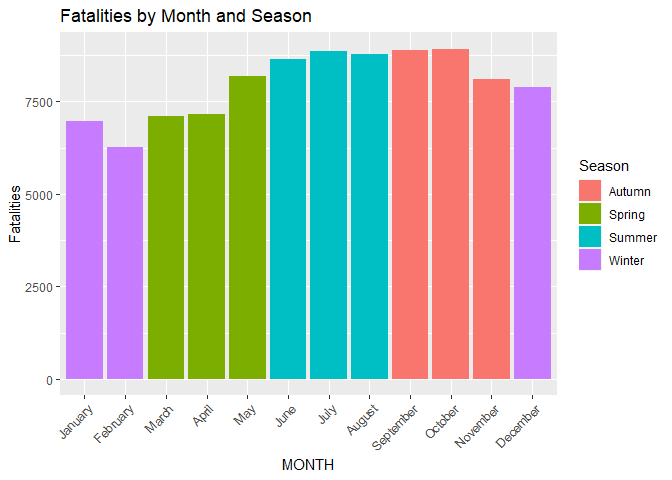
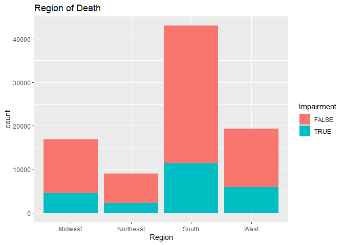

# Final Project DS202

#### Marissa Baietto, Ryan Dorle, Braeden Collings

## Introduction (ANYONE CAN FIX THIS SECTION TO MAKE IT CLEANER)

- Describe topic The goal of the project is to explore multiple datasets
  to better understand vehicle crashes. Understanding this topic better
  can lead to increased awareness, targeted policing efforts, and
  identification of common trends for accidents. Ultimately, the goal is
  the circumstances in which individuals get into vehicular accidents,
  and how to avoid fatal crashes.
- Why topic is important
- Research question In pursuit of the stated goal, we will explore the
  following questions:

1.  Does impairment affect fatality in crashes overall? When are
    impaired crashes most likely?

2.  What regions of the United States have the most fatal crashes? What
    conditions are present in those regions?

3.  How does the demographics of the driver affect crashes? Are changes
    based on occupants more prevalent for younger drivers?

4.  Are crashes affected by lighting and road conditions? How so, and
    what conditions are most impact?

5.  When are crashes most likely? Are there any seasonal effects, and
    are night crashes more likely than in the morning or afternoon?

6.  How is speeding related to the number of fatalities? Are younger
    drivers more prone to speeding? Is higher speeding limits associated
    with more fatalities?

## Data

### Structure

The link to the dataset is
<https://www.nhtsa.gov/file-downloads?p=nhtsa/downloads/FARS/> . The
NHTSA website contains a zip file containing the FARS report for every
year between 1975 and 2021. Each zip file contains 33 different csv
files for various aspects of a vehicle crash - data on the accident
itself, the vehicles driven, damage to the vehicles, the persons in each
vehicle, etc. The number of variables in these csv files ranges from 6
to 81+, and there are over 40,000 rows for each csv.

In creating a cohesive dataset, we first chose to analyze the years
2017-2021. The variables reported and elephant for the values of each
variable have been through multiple changes over the years, so selecting
a recent time period ensures that the reporting systems are nearly the
same for each year. In addition, having a 5 year time frame to analyze
allows us to see changes over time, and keeps the dataset from being so
large that it is unmanageable.

Utilizing all of the csvs would have introduced too many variables, so
we selected the csvs named “accident”, “person”, and “vehicle”.
“Accident” gives information on the time, place, and general aspects of
the accident such as the number of fatalities and the weather and light
conditions. “Person” contains data on the age and sex of each person in
the crash, as well as other variables such as whether the person
involved was drinking or under the influence of drugs at the time of the
crash. Lastly, “vehicle” gives facts regarding the number of occupants
in the vehicle, the state listed on the driver’s license, what the speed
limit was and whether the driver was speeding, and whether the accident
was a hit and run.

The “accident” csv has separate rows for each case, while the “person”
csv has separate rows for each person involved in the crash, both
passengers and drivers, and the “vehicle” csv has separate rows for each
vehicle involved in the crash. As seen in the code, we made decisions to
limit the number of rows for each accident to ensure that the dataset
would not be too large.

### Cleaning

First, we read in the 3 types of csv files for the years 2017 - 2021.

``` r
accident_2017 <- read_csv("2017.csv")
accident_2018 <- read_csv("2018.csv")
accident_2019 <- read_csv("2019.csv")
accident_2020 <- read_csv("2020.csv")
accident_2021 <- read_csv("2021.csv")

person_2017 <- read_csv("2017_person.csv")
person_2018 <- read_csv("2018_person.csv")
person_2019 <- read_csv("2019_person.csv")
person_2020 <- read_csv("2020_person.csv")
person_2021 <- read_csv("2021_person.csv")

vehicle_2017 <- read_csv("2017_vehicle.csv")
vehicle_2018 <- read_csv("2018_vehicle.csv")
vehicle_2019 <- read_csv("2019_vehicle.csv")
vehicle_2020 <- read_csv("2020_vehicle.csv")
vehicle_2021 <- read_csv("2021_vehicle.csv")
```

Originally, the “person” csv files were 24.1 MB large for each year.
GitHub’s size limit for uploading files to the reposirory is 24MB, which
meant that we could not upload the “person” csvs to GitHub. To overcome
this problem, we created a separate R Script and slimmed the csv files
there. We did so by opening the csv files for each year and filtering
such that (PER_NO == 1), meaning that only the driver is included in the
csv files. This brought the size of the csv down to meet the limits. We
then saved the new csv files as “(YEAR)\_person.csv”, and uploaded the
modified csv files to this project report.

Then, we selected the variables we needed for each type of csv.

``` r
accident_2017 <- accident_2017 %>% select(STATENAME, ST_CASE, MONTH, DAY, YEAR, HOUR, MINUTE, RUR_URBNAME, LATITUDE, LONGITUD, LGT_CONDNAME, WEATHER1NAME, FATALS, DRUNK_DR, DAY_WEEK)
accident_2018 <- accident_2018 %>% select(STATENAME, ST_CASE, MONTH, DAY, YEAR, HOUR, MINUTE, RUR_URBNAME, LATITUDE, LONGITUD, LGT_CONDNAME, WEATHER1NAME, FATALS, DRUNK_DR, DAY_WEEK)
accident_2019 <- accident_2019 %>% select(STATENAME, ST_CASE, MONTH, DAY, YEAR, HOUR, MINUTE, RUR_URBNAME, LATITUDE, LONGITUD, LGT_CONDNAME, WEATHER1NAME, FATALS, DRUNK_DR, DAY_WEEK)
accident_2020 <- accident_2020 %>% select(STATENAME, ST_CASE, MONTH, DAY, YEAR, HOUR, MINUTE, RUR_URBNAME, LATITUDE, LONGITUD, LGT_CONDNAME, WEATHERNAME, FATALS, DRUNK_DR, DAY_WEEK)
accident_2021 <- accident_2021 %>% select(STATENAME, ST_CASE, MONTH, DAY, YEAR, HOUR, MINUTE, RUR_URBNAME, LATITUDE, LONGITUD, LGT_CONDNAME, WEATHERNAME, FATALS, DAY_WEEK)

person_2017 <- person_2017 %>% select(AGE, SEXNAME, DRINKINGNAME, DRUGSNAME, LAG_HRSNAME, ST_CASE, VEH_NO, PER_NO)
person_2018 <- person_2018 %>% select(AGE, SEXNAME, DRINKINGNAME, DRUGSNAME, LAG_HRSNAME, ST_CASE, VEH_NO, PER_NO)
person_2019 <- person_2019 %>% select(AGE, SEXNAME, DRINKINGNAME, DRUGSNAME, LAG_HRSNAME, ST_CASE, VEH_NO, PER_NO)
person_2020 <- person_2020 %>% select(AGE, SEXNAME, DRINKINGNAME, DRUGSNAME, LAG_HRSNAME, ST_CASE, VEH_NO, PER_NO)
person_2021 <- person_2021 %>% select(AGE, SEXNAME, DRINKINGNAME, DRUGSNAME, LAG_HRSNAME, ST_CASE, VEH_NO, PER_NO)
```

There were 2 disreptencies between the years in the accident files.
First, “accident_2021” did not have a variable for “DRUNK_DR”. Second,
the naming of the variable containing information on the weather changed
in 2020 and 2021 from “WEATHER1NAME” to “WEATHERNAME”. (THIS WAS A GRAPH
THAT DIDN”T MAKE SENSE IN RYAN”S SECTION) We accounted for the
disreptency in weather by creating a duplicate variable named
“WEATHERNAME” in the 2017,2018,2019 dataframes and deleting the
“WEATHER1NAME” variables in those same dataframes.

``` r
accident_2017$WEATHERNAME <- accident_2017$WEATHER1NAME
accident_2018$WEATHERNAME <- accident_2018$WEATHER1NAME
accident_2019$WEATHERNAME <- accident_2019$WEATHER1NAME

accident_2017 <- accident_2017 %>% select(-WEATHER1NAME)
accident_2018 <- accident_2018 %>% select(-WEATHER1NAME)
accident_2019 <- accident_2019 %>% select(-WEATHER1NAME)
```

To enable us to merge the datasets for each year, we created a “YEAR”
variable for the “person” and “vehicle” datasets.

``` r
person_2017$YEAR = 2017
person_2018$YEAR = 2018
person_2019$YEAR = 2019
person_2020$YEAR = 2020
person_2021$YEAR = 2021

vehicle_2017$YEAR = 2017
vehicle_2018$YEAR = 2018
vehicle_2019$YEAR = 2019
vehicle_2020$YEAR = 2020
vehicle_2021$YEAR = 2021
```

To merge the datasets together, we first created 5 dataframes for each
year, with each dataframe being a merge of the year’s accident, person,
and year dataframes. This was performed with a left_join with “accident”
as the main dataframe. After “accident” and “person” were merged by year
and st_case.

ST_CASE is a unique identifier for each accident that occured in the
state. Vehicles and persons involved in the same crash have identical
ST_CASE numbers. For each state, ST_CASE starts with a new number, but
has the same format. For example, Alabama’s ST_CASE numbers are in the
10,000s, Alaska’s ST_CASE numbers are in the 20,000s, and so on with the
states in order alphabetically. ST_CASE numbers reset each year, meaning
that the first case in Alabama in 2017, 2018, 2019, 2020, and 2021 have
the ST_CASE number 10001.

We merged the new dataframes with the vehicle dataframes for each year
by performing a left merge by year, st_case, and veh_no. VEH_NO is a
unique identifier for each vehicle involved in the crash, and it resets
to 1 for each new accident. Merging on VEH_No ensured that we were
matching each driver to the vehicle they drove, as the “person” file
included the vehicle number as well for each individual.

``` r
df_2017 <- left_join(accident_2017, person_2017, by=c('YEAR', 'ST_CASE'))
df_2018 <- left_join(accident_2018, person_2018, by=c('YEAR', 'ST_CASE'))
df_2019 <- left_join(accident_2019, person_2019, by=c('YEAR', 'ST_CASE'))
df_2020 <- left_join(accident_2020, person_2020, by=c('YEAR', 'ST_CASE'))
df_2021 <- left_join(accident_2021, person_2021, by=c('YEAR', 'ST_CASE'))


df_2017 <- left_join(df_2017, vehicle_2017, by=c('YEAR', 'ST_CASE', 'VEH_NO'))
df_2018 <- left_join(df_2018, vehicle_2018, by=c('YEAR', 'ST_CASE', 'VEH_NO'))
df_2019 <- left_join(df_2019, vehicle_2019, by=c('YEAR', 'ST_CASE', 'VEH_NO'))
df_2020 <- left_join(df_2020, vehicle_2020, by=c('YEAR', 'ST_CASE', 'VEH_NO'))
df_2021 <- left_join(df_2021, vehicle_2021, by=c('YEAR', 'ST_CASE', 'VEH_NO'))
```

To merge all of the years together, we used the bind_rows function and
put the years in order from 2017 to 2021. Again, we confronted the
problem that the file was too large to upload to GitHub. So, we selected
one vehicle per crash, by filtering such that VEH_NO == 1. There is
always a vehicle with number equal to 1 for each accident because the
first vehicle listed for each accident has a vehicle number equal to
one. We also only chose the even state case numbers. This ensured that
each state would have the same proportion of accidents that they had in
the original file, and choosing odd state case numbers gave us a smaller
random sample from the original dataset.

``` r
df <- bind_rows(df_2017, df_2018,df_2019,df_2020,df_2021)
df1 <- df %>% group_by(STATENAME, YEAR) %>% filter(VEH_NO == 1 & ST_CASE %% 2 == 0) #add & ST_CASE %% 2 == 0
```

We noticed that there were 2 strange columns in the final dataframe
named ‘…22’ and ‘…21’. We believe that these were created when we joined
the ‘accident’, ‘person’, and ‘vehicle’ datasets, as there were so many
variables that R was not able to show them all when we viewed the merged
datasets. We took these columns out, as they had no value to our
analysis.

``` r
colnames(df1)
```

    ##  [1] "STATENAME"    "ST_CASE"      "MONTH"        "DAY"          "YEAR"        
    ##  [6] "HOUR"         "MINUTE"       "RUR_URBNAME"  "LATITUDE"     "LONGITUD"    
    ## [11] "LGT_CONDNAME" "FATALS"       "DRUNK_DR"     "DAY_WEEK"     "WEATHERNAME" 
    ## [16] "AGE"          "SEXNAME"      "DRINKINGNAME" "DRUGSNAME"    "LAG_HRSNAME" 
    ## [21] "VEH_NO"       "PER_NO"       "...23"        "HIT_RUNNAME"  "NUMOCCSNAME" 
    ## [26] "L_STATENAME"  "SPEEDRELNAME" "VSPD_LIM"     "...22"

``` r
df1 <- df1 %>% select(-one_of('...22', '...21', '...23'))
```

To ease running the code, we saved the final dataset to “master.csv” so
that we could then only run the line importing “master.csv” rather than
run the code above repeatedly.

``` r
write.csv(df1, 'master.csv')
```

### Variables

- STATENAME: The state the fatal crash occured in
- WEATHERNAME: The type of weather outside at the time and location of
  the crash.
- VEH_NO: Vehicle Number, a number assigned to each vehicle in the
  crash.
- PER_NO: Person Number, A unique number assigned to any person involved
  in the crash.
- DRUGSNAME: Were there drugs involved in the crash if so the name of
  the drug.
- DRINKINGNAME: Was drinking involved in the crash if so what alcohol.  
- SEXNAME: The gender of people related to the crash.
- AGE: Age of people in the crash.
- DRUNK_DR: Drinking Drivers, The number of drinking drivers involved in
  the crash.
- FATALS: The number of fatalities in the crash.
- WEATHER1NAME: Atmospheric conditions at the time of the crash.
- LGT_CONDNAME: What was the lighting condition at the time of the
  crash.
- LATITUDE: The location of the crash using global positioning (East and
  West).
- LONGITUD: The location of the crash using global positioning (North
  and South).
- RUR_URBNAME: Land Use, the segment of the traffic way on which the
  crash occurred based on urbanized areas.
- HOUR: The time of the crash in hours.
- MINUTE: The time of the crash in minutes.
- MONTH: The month the crash occurred in.
- DAY: The day the crash occurred on.
- YEAR: The year in which the crash happened.
- ST_CASE: Unique case number assigned to each crash.
- HIT_RUN: Whether the crash was a hit and run.
- NUMOCCS: Number of occupants in the vehicle.
- L_STATE: The state listed on the driver’s license.
- SPEEDREL: Whether the crash was speeding related.
- VSPD_LIM: What the speeding limit was.

## Methods

- Methods utilized, if used

## Results

- All results and graphics
  - For each graphic,
    - Motivation for making the graphic
    - Insights obtained from the graphics
    - Necessary explanations
  - Formatting
    - Axis Labels, Title, Captions, Color Scheme if necessary
    - Each graphic illustrates one point
    - Make color scheme cohesive
    - Avoid repetition
- List trials and errors
  - Critical of findings
  - Multiple approaches and techniques used to verify unintuitive
    results
- Any additional research used to help understand/explain findings

``` r
library(readr)
library(tidyverse)
master <- read_csv('master.csv')
head(master)
```

    ## # A tibble: 6 × 28
    ##    ...1 STATENAME ST_CASE MONTH   DAY  YEAR  HOUR MINUTE RUR_URBNAME LATITUDE
    ##   <dbl> <chr>       <dbl> <dbl> <dbl> <dbl> <dbl>  <dbl> <chr>          <dbl>
    ## 1     1 Alabama     10002     2    14  2017    14     59 Urban           34.7
    ## 2     2 Alabama     10004     1     1  2017    16     55 Urban           33.5
    ## 3     3 Alabama     10006     1     6  2017    18     40 Rural           34.4
    ## 4     4 Alabama     10008     1    11  2017    16     50 Rural           31.0
    ## 5     5 Alabama     10010     1    14  2017     4      0 Urban           33.7
    ## 6     6 Alabama     10012     1    19  2017    21     50 Rural           32.1
    ## # ℹ 18 more variables: LONGITUD <dbl>, LGT_CONDNAME <chr>, FATALS <dbl>,
    ## #   DRUNK_DR <dbl>, DAY_WEEK <dbl>, WEATHERNAME <chr>, AGE <dbl>,
    ## #   SEXNAME <chr>, DRINKINGNAME <chr>, DRUGSNAME <chr>, LAG_HRSNAME <chr>,
    ## #   VEH_NO <dbl>, PER_NO <dbl>, HIT_RUNNAME <chr>, NUMOCCSNAME <chr>,
    ## #   L_STATENAME <chr>, SPEEDRELNAME <chr>, VSPD_LIM <dbl>

### When are crashes most likely? Are there any seasonal effects, and are night crashes more likely than in the morning or afternoon?

#### Year

``` r
master %>% group_by(YEAR) %>% ggplot(aes(x = YEAR, weight = FATALS)) + geom_bar() + ggtitle("Fatalities Over Last 5 Years") + ylab("Fatalities") + xlab("Year")
```

<!-- -->

#### Month and Season

``` r
master <- master %>% 

  mutate(Season = case_when( 

    MONTH %in% c("3","4","5") ~ "Spring", 

    MONTH %in% c("6","7","8") ~ "Summer", 

    MONTH %in% c("9","10","11") ~ "Autumn", 

    MONTH %in% c("12","1","2") ~ "Winter", 

    TRUE ~ "Other" 

  ))
```

``` r
master %>% ggplot(aes(x = MONTH, weight = FATALS, fill = Season)) + geom_bar() + scale_x_discrete(limits = c("January","February","March","April","May","June","July","August","September","October","November","December"))+
  theme(axis.text.x = element_text(angle=45, vjust=1, hjust=1)) + ylab("Fatalities") + ggtitle("Fatalities by Month and Season")
```

<!-- -->

#### Month and Day

``` r
df %>% group_by(MONTH) %>% summarise(count = sum(FATALS)) %>% arrange(desc(count))
```

    ## # A tibble: 12 × 2
    ##    MONTH count
    ##    <dbl> <dbl>
    ##  1    10 27965
    ##  2     7 27845
    ##  3     8 27582
    ##  4     6 27579
    ##  5     9 27564
    ##  6     5 25770
    ##  7    11 25437
    ##  8    12 24720
    ##  9     4 22626
    ## 10     3 22608
    ## 11     1 21837
    ## 12     2 20478

``` r
farb<-c("#c91e1e","#c80028","#ce0053","#d3007f","#d900ae","#dd00de","#b500e4", "#8a00e9","#6900d9","#5700e7","#4100f3", "#1e00ff")
plot_names <- c('1' = "January",
                '2' = "February",
                '3' = "March",
                '4' = "April",
                '5' = "May",
                '6' = "June",
                '7' = "July",
                '8' = "August",
                '9' = "September",
                '10' = "October",
                '11' = "November",
                '12' = "December")

master %>% group_by(DAY) %>% ggplot(aes(x = DAY, weight = FATALS)) + geom_bar(aes(fill = factor(MONTH, levels = c("10","7","8","6","9","5","11","12","4","3","1","2"))))+ facet_wrap(~MONTH, labeller = as_labeller(plot_names)) +geom_hline(yintercept = 200, color='RED') + theme(legend.position="bottom") + scale_fill_manual(values= farb)+ theme( legend.position="right")+labs(fill='Monthly Fatalities') + ylab("Fatalities") + ggtitle("Fatalities by Day and Month")
```

<!-- -->

Originally showed same pattern for every month. Originally showed high
in January and Feburary and low for rest of year.

``` r
master %>% filter(AGE < 900) %>% filter(AGE == min(AGE))
```

    ## # A tibble: 1 × 29
    ##    ...1 STATENAME ST_CASE MONTH   DAY  YEAR  HOUR MINUTE RUR_URBNAME LATITUDE
    ##   <dbl> <chr>       <dbl> <dbl> <dbl> <dbl> <dbl>  <dbl> <chr>          <dbl>
    ## 1 49382 Texas      483296    12    25  2019    10     15 Rural           31.0
    ## # ℹ 19 more variables: LONGITUD <dbl>, LGT_CONDNAME <chr>, FATALS <dbl>,
    ## #   DRUNK_DR <dbl>, DAY_WEEK <dbl>, WEATHERNAME <chr>, AGE <dbl>,
    ## #   SEXNAME <chr>, DRINKINGNAME <chr>, DRUGSNAME <chr>, LAG_HRSNAME <chr>,
    ## #   VEH_NO <dbl>, PER_NO <dbl>, HIT_RUNNAME <chr>, NUMOCCSNAME <chr>,
    ## #   L_STATENAME <chr>, SPEEDRELNAME <chr>, VSPD_LIM <dbl>, Season <chr>

#### Weekday

``` r
df1 %>% ggplot(aes(x = as.factor(DAY_WEEK), weight = FATALS)) + geom_bar() + scale_x_discrete(
                      labels=c("Sunday","Monday", "Tuesday", "Wednesday","Thursday","Friday", "Saturday")) + xlab("Weekday") + ylab("Fatalities") + ggtitle("Fatalities by Weekday")
```

<!-- -->

#### Hour

``` r
df1 %>% ggplot(aes(x = HOUR)) + geom_histogram(bins = 100) + ylab("Fatalities") + ggtitle("Fatalities by Hour")
```

<!-- -->

``` r
df1 %>% filter(HOUR >24)
```

    ## # A tibble: 617 × 27
    ## # Groups:   STATENAME, YEAR [109]
    ##    STATENAME  ST_CASE MONTH   DAY  YEAR  HOUR MINUTE RUR_URBNAME LATITUDE
    ##    <chr>        <dbl> <dbl> <dbl> <dbl> <dbl>  <dbl> <chr>          <dbl>
    ##  1 Alabama      10224     4    14  2017    99     99 Rural           30.3
    ##  2 Alabama      10624    10     2  2017    99     99 Urban           30.6
    ##  3 Alaska       20026     6     1  2017    99     99 Rural           55.4
    ##  4 Alaska       20044     8    22  2017    99     99 Rural           64.7
    ##  5 Arizona      40410     1     8  2017    99     99 Rural          100. 
    ##  6 Arizona      40812    12     5  2017    99     99 Urban           32.1
    ##  7 Arizona      40930    12    29  2017    99     99 Rural           32.7
    ##  8 Arkansas     50452     5    27  2017    99     99 Rural           36.2
    ##  9 California   60004     1    14  2017    99     99 Rural           38.1
    ## 10 California   60174     3     6  2017    99     99 Rural           34.9
    ## # ℹ 607 more rows
    ## # ℹ 18 more variables: LONGITUD <dbl>, LGT_CONDNAME <chr>, FATALS <dbl>,
    ## #   DRUNK_DR <dbl>, DAY_WEEK <dbl>, WEATHERNAME <chr>, AGE <dbl>,
    ## #   SEXNAME <chr>, DRINKINGNAME <chr>, DRUGSNAME <chr>, LAG_HRSNAME <chr>,
    ## #   VEH_NO <dbl>, PER_NO <dbl>, HIT_RUNNAME <chr>, NUMOCCSNAME <chr>,
    ## #   L_STATENAME <chr>, SPEEDRELNAME <chr>, VSPD_LIM <dbl>

``` r
df1 %>% filter(HOUR <= 24) %>% ggplot(aes(x = as.factor(HOUR), weight = FATALS)) + geom_bar() + ylab("Fatalities") + ggtitle("Fatalities by Hour") + xlab("HOUR")
```

<!-- -->

There is a strange outlier with hour, so I will remove that.

### How is speeding related to the number of fatalities? Are younger drivers more prone to speeding? Is higher speeding limits associated with more fatalities?

#### Speeding

#### Speeding and Weekday

#### Speeding and Age

#### Speedlimits

### Does impairment affect fatality in crashes overall? When are impaired crashes most likely?

``` r
master$ImpairmentAlcohol <- ifelse(master$DRINKINGNAME %in% c("No (Alcohol Not Involved)", "Unknown (Police Reported)", "Not Reported", "Reported as Unknown"), FALSE, TRUE)

master$ImpairmentDrugs <- ifelse(master$DRUGSNAME %in% c("No (drugs not involved)", "Unknown (Police Reported)", "Not Reported", "Reported as Unknown"), FALSE, TRUE)

master <- master %>% mutate(
  Impairment = as.logical(pmax(ImpairmentDrugs, ImpairmentAlcohol))
)

master %>% ggplot(aes(x = Impairment)) + geom_bar()
```

<!-- -->

``` r
master %>% filter(Impairment == TRUE) %>%
  filter(HOUR <=24) %>% ggplot(aes(x = HOUR), fill = factor(MONTH)) + geom_bar(bins = 24)
```

    ## Warning in geom_bar(bins = 24): Ignoring unknown parameters: `bins`

<!-- -->

### What regions of the United States have the most fatal crashes? What conditions are present in those regions?

``` r
master <- master %>% 

  mutate(Region = case_when( 

    STATENAME %in% c("Connecticut", "Maine", "Massachusetts", "New Hampshire", "Rhode Island", "Vermont", "District of Columbia", "New Jersey", "New York", "Pennsylvania") ~ "Northeast", 

    STATENAME %in% c("Illinois", "Indiana", "Iowa", "Kansas", "Michigan", "Minnesota", "Missouri", "Nebraska", "North Dakota", "Ohio", "South Dakota", "Wisconsin") ~ "Midwest", 

    STATENAME %in% c("Alabama", "Arkansas", "Delaware", "Florida", "Georgia", "Kentucky", "Louisiana", "Maryland", "Mississippi", "North Carolina", "Oklahoma", "South Carolina", "Tennessee", "Texas", "Virginia", "West Virginia") ~ "South", 

    STATENAME %in% c("Alaska", "Arizona", "California", "Colorado", "Hawaii", "Idaho", "Montana", "Nevada", "New Mexico", "Oregon", "Utah", "Washington", "Wyoming") ~ "West", 

    TRUE ~ "Other" 

  )) 

master %>% ggplot(aes(x = Region)) + geom_bar()
```

<!-- -->

### How does the demographics of the driver affect crashes? Are changes based on occupants more prevalent for younger drivers?

``` r
master %>% ggplot(aes(x=AGE, fill = SEXNAME)) + geom_histogram()
```

    ## `stat_bin()` using `bins = 30`. Pick better value with `binwidth`.

<!-- -->

Similar to the hour, there is a stange outlier that we will eliminate

``` r
master %>% ggplot(aes(x=AGE, fill = SEXNAME)) + geom_histogram() + scale_x_continuous(name="AGE", limits=c(0, 100)) + xlab("Age - Colored by Sex") + ylab("Number of Crashes") + ggtitle("Crashes per Demographic")
```

    ## `stat_bin()` using `bins = 30`. Pick better value with `binwidth`.

    ## Warning: Removed 2779 rows containing non-finite values (`stat_bin()`).

    ## Warning: Removed 8 rows containing missing values (`geom_bar()`).

<!-- -->

This data clearly shows that driver age and sex are largely impactful in
fatal car crashes.

``` r
master %>% ggplot(aes(x=LGT_CONDNAME)) + geom_bar() + theme(axis.text.x = element_text(angle = 30, vjust = 0.5)) + ggtitle("Count of Crashes based on Lighting Conditions") + ylab("Number of Crashes") + xlab("Lighting Condition")
```

<!-- -->

Looking at the time of day, it makes sense that daylight would have
significantly more crashes than dark. It is important to not that when
dark, there are significantly more when the area is not lighted.

``` r
master %>% ggplot(aes(y=STATENAME, fill = WEATHERNAME)) + geom_bar() + xlab("Number of Crashes") + ylab("State Name") + labs(fill = "Weather Condition") + ggtitle("Weather Conditions for each Crash per State")
```

<!-- -->

Looking at crashes per state, it is clear even in colder states, where
snow is common, clear or cloudy conditions are the most common
conditions for crashes

``` r
master %>% ggplot(aes(x=WEATHERNAME, fill = LGT_CONDNAME)) + geom_bar() + theme(axis.text.x = element_text(angle = 30, vjust = 0.5)) + ggtitle("Count of Crashes based on Weather Conditions") + ylab("Number of Crashes") + xlab("Weather Condition") + labs(fill = "Lighting Condition")
```

<!-- -->

This seemingly unimportant data suggests the conditions to be most
careful for are cloudy or clear days when the area is lighted.

## Conclusion

- Overall idea
- Interesting further questions
- Ideas for future research
