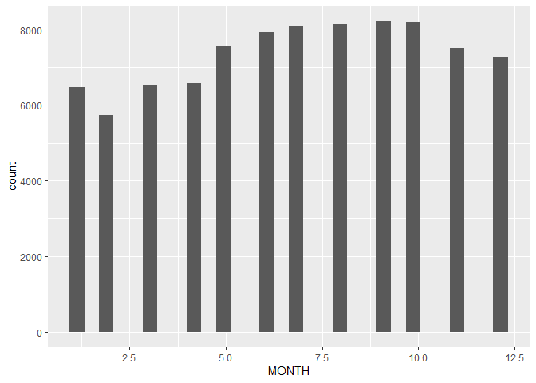
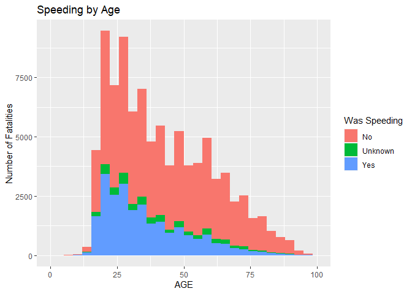

# Final Project DS202

#### Marissa Baietto, Ryan Dorle, Braeden Collings

## Introduction

- Describe topic
- Why topic is important
- Research question

## Data

- Structure
- How it was cleaned
- Variables

## Methods

- Methods utilized, if used

## Results

- All results and graphics
  - For each graphic,
    - Motivation for making the graphic
    - Insights obtained from the graphics
    - Necessary explanations
  - Formatting
    - Axis Labels, Title, Captions, Color Scheme if necessary
    - Each graphic illustrates one point
    - Make color scheme cohesive
    - Avoid repetition
- List trials and errors
  - Critical of findings
  - Multiple approaches and techniques used to verify unintuitive
    results
- Any additional research used to help understand/explain findings

### Conclusion

- Overall idea
- Interesting further questions
- Ideas for future research

Here is the link to all of the csv files we used:
<https://www.nhtsa.gov/file-downloads?p=nhtsa/downloads/FARS/>

Importing the accident datasets.

``` r
library(tidyverse)
```

Selecting the variables we need.

``` r
accident_2017 <- accident_2017 %>% select(STATENAME, ST_CASE, MONTH, DAY, YEAR, HOUR, MINUTE, RUR_URBNAME, LATITUDE, LONGITUD, LGT_CONDNAME, WEATHER1NAME, FATALS, DRUNK_DR, DAY_WEEK)
accident_2018 <- accident_2018 %>% select(STATENAME, ST_CASE, MONTH, DAY, YEAR, HOUR, MINUTE, RUR_URBNAME, LATITUDE, LONGITUD, LGT_CONDNAME, WEATHER1NAME, FATALS, DRUNK_DR, DAY_WEEK)
accident_2019 <- accident_2019 %>% select(STATENAME, ST_CASE, MONTH, DAY, YEAR, HOUR, MINUTE, RUR_URBNAME, LATITUDE, LONGITUD, LGT_CONDNAME, WEATHER1NAME, FATALS, DRUNK_DR, DAY_WEEK)
accident_2020 <- accident_2020 %>% select(STATENAME, ST_CASE, MONTH, DAY, YEAR, HOUR, MINUTE, RUR_URBNAME, LATITUDE, LONGITUD, LGT_CONDNAME, WEATHERNAME, FATALS, DRUNK_DR, DAY_WEEK)
accident_2021 <- accident_2021 %>% select(STATENAME, ST_CASE, MONTH, DAY, YEAR, HOUR, MINUTE, RUR_URBNAME, LATITUDE, LONGITUD, LGT_CONDNAME, WEATHERNAME, FATALS, DAY_WEEK)
#2021 does not have drunk driving variable

accident_2017$WEATHERNAME <- accident_2017$WEATHER1NAME
accident_2018$WEATHERNAME <- accident_2018$WEATHER1NAME
accident_2019$WEATHERNAME <- accident_2019$WEATHER1NAME

accident_2017 <- accident_2017 %>% select(-WEATHER1NAME)
accident_2018 <- accident_2018 %>% select(-WEATHER1NAME)
accident_2019 <- accident_2019 %>% select(-WEATHER1NAME)
```

Importing the person datasets.

``` r
person_2017 <- read_csv("2017_person.csv")
person_2018 <- read_csv("2018_person.csv")
person_2019 <- read_csv("2019_person.csv")
person_2020 <- read_csv("2020_person.csv")
person_2021 <- read_csv("2021_person.csv")
```

Selecting person variables.

``` r
person_2017 <- person_2017 %>% select(AGE, SEXNAME, DRINKINGNAME, DRUGSNAME, LAG_HRSNAME, ST_CASE, VEH_NO, PER_NO)
person_2018 <- person_2018 %>% select(AGE, SEXNAME, DRINKINGNAME, DRUGSNAME, LAG_HRSNAME, ST_CASE, VEH_NO, PER_NO)
person_2019 <- person_2019 %>% select(AGE, SEXNAME, DRINKINGNAME, DRUGSNAME, LAG_HRSNAME, ST_CASE, VEH_NO, PER_NO)
person_2020 <- person_2020 %>% select(AGE, SEXNAME, DRINKINGNAME, DRUGSNAME, LAG_HRSNAME, ST_CASE, VEH_NO, PER_NO)
person_2021 <- person_2021 %>% select(AGE, SEXNAME, DRINKINGNAME, DRUGSNAME, LAG_HRSNAME, ST_CASE, VEH_NO, PER_NO)
```

Adding year variable to the datasets.

``` r
person_2017$YEAR = 2017
person_2018$YEAR = 2018
person_2019$YEAR = 2019
person_2020$YEAR = 2020
person_2021$YEAR = 2021
```

Importing Vehicle Datasets

``` r
vehicle_2017 <- read_csv("2017_vehicle.csv")
vehicle_2018 <- read_csv("2018_vehicle.csv")
vehicle_2019 <- read_csv("2019_vehicle.csv")
vehicle_2020 <- read_csv("2020_vehicle.csv")
vehicle_2021 <- read_csv("2021_vehicle.csv")
```

Adding year variable to the datasets.

``` r
vehicle_2017$YEAR = 2017
vehicle_2018$YEAR = 2018
vehicle_2019$YEAR = 2019
vehicle_2020$YEAR = 2020
vehicle_2021$YEAR = 2021
```

Merging the datasets.

``` r
df_2017 <- left_join(accident_2017, person_2017, by=c('YEAR', 'ST_CASE'))
df_2018 <- left_join(accident_2018, person_2018, by=c('YEAR', 'ST_CASE'))
df_2019 <- left_join(accident_2019, person_2019, by=c('YEAR', 'ST_CASE'))
df_2020 <- left_join(accident_2020, person_2020, by=c('YEAR', 'ST_CASE'))
df_2021 <- left_join(accident_2021, person_2021, by=c('YEAR', 'ST_CASE'))


df_2017 <- left_join(df_2017, vehicle_2017, by=c('YEAR', 'ST_CASE', 'VEH_NO'))
df_2018 <- left_join(df_2018, vehicle_2018, by=c('YEAR', 'ST_CASE', 'VEH_NO'))
df_2019 <- left_join(df_2019, vehicle_2019, by=c('YEAR', 'ST_CASE', 'VEH_NO'))
df_2020 <- left_join(df_2020, vehicle_2020, by=c('YEAR', 'ST_CASE', 'VEH_NO'))
df_2021 <- left_join(df_2021, vehicle_2021, by=c('YEAR', 'ST_CASE', 'VEH_NO'))
```

Creating one dataset with all years.

``` r
df <- bind_rows(df_2017, df_2018,df_2019,df_2020,df_2021)
df1 <- df %>% group_by(STATENAME, YEAR) %>% filter(VEH_NO == 1 & ST_CASE %% 2 == 0) #add & ST_CASE %% 2 == 0
```

``` r
colnames(df1)
```

    ##  [1] "STATENAME"    "ST_CASE"      "MONTH"        "DAY"          "YEAR"        
    ##  [6] "HOUR"         "MINUTE"       "RUR_URBNAME"  "LATITUDE"     "LONGITUD"    
    ## [11] "LGT_CONDNAME" "FATALS"       "DRUNK_DR"     "DAY_WEEK"     "WEATHERNAME" 
    ## [16] "AGE"          "SEXNAME"      "DRINKINGNAME" "DRUGSNAME"    "LAG_HRSNAME" 
    ## [21] "VEH_NO"       "PER_NO"       "...23"        "HIT_RUNNAME"  "NUMOCCSNAME" 
    ## [26] "L_STATENAME"  "SPEEDRELNAME" "VSPD_LIM"     "...22"

``` r
df1 <- df1 %>% select(-one_of('...22', '...21'))
```

Saving the final dataset to ‘master.csv’

``` r
write.csv(df1, 'master.csv')
```

## Discription of Data

The data we chose to work with is from the National Highway Traffic
Safety Administration. The administration has a system called FARS or
the Fatality Analysis Reporting System in which vehicle crashes are
noted. The data is comprised from police reports, death certificates,
various medical reports, and department data. We chose to look at the
years from 2017-2021 for our report.

``` r
library(readr)
master <- read_csv('master.csv')
head(master)
```

    ## # A tibble: 6 × 29
    ##    ...1 STATENAME ST_CASE MONTH   DAY  YEAR  HOUR MINUTE RUR_URBNAME LATITUDE
    ##   <dbl> <chr>       <dbl> <dbl> <dbl> <dbl> <dbl>  <dbl> <chr>          <dbl>
    ## 1     1 Alabama     10002     2    14  2017    14     59 Urban           34.7
    ## 2     2 Alabama     10004     1     1  2017    16     55 Urban           33.5
    ## 3     3 Alabama     10006     1     6  2017    18     40 Rural           34.4
    ## 4     4 Alabama     10008     1    11  2017    16     50 Rural           31.0
    ## 5     5 Alabama     10010     1    14  2017     4      0 Urban           33.7
    ## 6     6 Alabama     10012     1    19  2017    21     50 Rural           32.1
    ## # ℹ 19 more variables: LONGITUD <dbl>, LGT_CONDNAME <chr>, FATALS <dbl>,
    ## #   DRUNK_DR <dbl>, DAY_WEEK <dbl>, WEATHERNAME <chr>, AGE <dbl>,
    ## #   SEXNAME <chr>, DRINKINGNAME <chr>, DRUGSNAME <chr>, LAG_HRSNAME <chr>,
    ## #   VEH_NO <dbl>, PER_NO <dbl>, ...24 <dbl>, HIT_RUNNAME <chr>,
    ## #   NUMOCCSNAME <chr>, L_STATENAME <chr>, SPEEDRELNAME <chr>, VSPD_LIM <dbl>

## Marginal Summaries

- STATENAME: The state the fatal crash occured in
- WEATHERNAME: The type of weather outside at the time and location of
  the crash.
- VEH_NO: Vehicle Number, a number assigned to each vehicle in the
  crash.
- PER_NO: Person Number, A unique number assigned to any person involved
  in the crash.
- DRUGSNAME: Were there drugs involved in the crash if so the name of
  the drug.
- DRINKINGNAME: Was drinking involved in the crash if so what alcohol.  
- SEXNAME: The gender of people related to the crash.
- AGE: Age of people in the crash.
- DRUNK_DR: Drinking Drivers, The number of drinking drivers involved in
  the crash.
- FATALS: The number of fatalities in the crash.
- WEATHER1NAME: Atmospheric conditions at the time of the crash.
- LGT_CONDNAME: What was the lighting condition at the time of the
  crash.
- LATITUDE: The location of the crash using global positioning (East and
  West).
- LONGITUD: The location of the crash using global positioning (North
  and South).
- RUR_URBNAME: Land Use, the segment of the traffic way on which the
  crash occurred based on urbanized areas.
- HOUR: The time of the crash in hours.
- MINUTE: The time of the crash in minutes.
- MONTH: The month the crash occurred in.
- DAY: The day the crash occurred on.
- YEAR: The year in which the crash happened.
- ST_CASE: Unique case number assigned to each crash.
- HIT_RUN: Whether the crash was a hit and run.
- NUMOCCS: Number of occupants in the vehicle.
- L_STATE: The state listed on the driver’s license.
- SPEEDREL: Whether the crash was speeding related.
- VSPD_LIM: What the speeding limit was.

# Research Goals and Questions

The goal of the project is to explore the data set to better understand
vehicle crashes. Understanding this topic better can lead to increased
awareness, targeted policing efforts, and identification of common
trends for accidents. Ultimately, the goal is the circumstances in which
individuals get into vehicular accidents, and how to avoid fatal
crashes.

In pursuit of the stated goal, we will explore the following questions:

1.  Does impairment affect fatality in crashes overall? When are
    impaired crashes most likely?

2.  What regions of the United States have the most fatal crashes? What
    conditions are present in those regions?

3.  How does the demographics of the driver affect crashes? Are changes
    based on occupants more prevalent for younger drivers?

4.  Are crashes affected by lighting and road conditions? How so, and
    what conditions are most impact?

5.  When are crashes most likely? Are there any seasonal effects, and
    are night crashes more likely than in the morning or afternoon?

6.  How is speeding related to the number of fatalities? Are younger
    drivers more prone to speeding? Is higher speeding limits associated
    with more fatalities?

### When are crashes most likely? Are there any seasonal effects, and are night crashes more likely than in the morning or afternoon?

``` r
library(tidyverse)
master %>% group_by(YEAR) %>% ggplot(aes(x = YEAR, weight = FATALS)) + geom_bar() + ggtitle("Fatalities Over Last 5 Years") + ylab("Fatalities") + xlab("Year")
```

<!-- -->

``` r
df %>% group_by(MONTH) %>% summarise(count = sum(FATALS)) %>% arrange(desc(count))
```

    ## # A tibble: 12 × 2
    ##    MONTH count
    ##    <dbl> <dbl>
    ##  1    10 27965
    ##  2     7 27845
    ##  3     8 27582
    ##  4     6 27579
    ##  5     9 27564
    ##  6     5 25770
    ##  7    11 25437
    ##  8    12 24720
    ##  9     4 22626
    ## 10     3 22608
    ## 11     1 21837
    ## 12     2 20478

``` r
farb <- c("#4100f3", "#1e00ff", "#5700e7", "#6900d9", "#dd00de", "#d3007f", "#c80028", "#ce0053", "#d900ae", "#c91e1e", "#b500e4", "#8a00e9")
farb<-c("#c91e1e","#c80028","#ce0053","#d3007f","#d900ae","#dd00de","#b500e4", "#8a00e9","#6900d9","#5700e7","#4100f3", "#1e00ff")
plot_names <- c('1' = "January",
                '2' = "February",
                '3' = "March",
                '4' = "April",
                '5' = "May",
                '6' = "June",
                '7' = "July",
                '8' = "August",
                '9' = "September",
                '10' = "October",
                '11' = "November",
                '12' = "December")

master %>% group_by(DAY) %>% ggplot(aes(x = DAY, weight = FATALS)) + geom_bar(aes(fill = factor(MONTH, levels = c("10","7","8","6","9","5","11","12","4","3","1","2"))))+ facet_wrap(~MONTH, labeller = as_labeller(plot_names)) +geom_hline(yintercept = 200, color='RED') + theme(legend.position="bottom") + scale_fill_manual(values= farb)+ theme( legend.position="right")+labs(fill='Monthly Fatalities') + ylab("Fatalities") + ggtitle("Fatalities by Day and Month")
```

<!-- --> Originally
showed same pattern for every month. Originally showed high in January
and Feburary and low for rest of year.

``` r
df1 %>% ggplot(aes(x = MONTH)) + geom_histogram()
```

    ## `stat_bin()` using `bins = 30`. Pick better value with `binwidth`.

<!-- -->

It appears that fatal crashes occur the most in the beginning of the
year, and decrease heavily until December for all of the years.

``` r
df1 %>% ggplot(aes(x = HOUR)) + geom_histogram(bins = 100) + ylab("Fatalities") + ggtitle("Fatalities by Hour")
```

<!-- -->

``` r
df1 %>% filter(HOUR >24)
```

    ## # A tibble: 617 × 28
    ## # Groups:   STATENAME, YEAR [109]
    ##    STATENAME  ST_CASE MONTH   DAY  YEAR  HOUR MINUTE RUR_URBNAME LATITUDE
    ##    <chr>        <dbl> <dbl> <dbl> <dbl> <dbl>  <dbl> <chr>          <dbl>
    ##  1 Alabama      10224     4    14  2017    99     99 Rural           30.3
    ##  2 Alabama      10624    10     2  2017    99     99 Urban           30.6
    ##  3 Alaska       20026     6     1  2017    99     99 Rural           55.4
    ##  4 Alaska       20044     8    22  2017    99     99 Rural           64.7
    ##  5 Arizona      40410     1     8  2017    99     99 Rural          100. 
    ##  6 Arizona      40812    12     5  2017    99     99 Urban           32.1
    ##  7 Arizona      40930    12    29  2017    99     99 Rural           32.7
    ##  8 Arkansas     50452     5    27  2017    99     99 Rural           36.2
    ##  9 California   60004     1    14  2017    99     99 Rural           38.1
    ## 10 California   60174     3     6  2017    99     99 Rural           34.9
    ## # ℹ 607 more rows
    ## # ℹ 19 more variables: LONGITUD <dbl>, LGT_CONDNAME <chr>, FATALS <dbl>,
    ## #   DRUNK_DR <dbl>, DAY_WEEK <dbl>, WEATHERNAME <chr>, AGE <dbl>,
    ## #   SEXNAME <chr>, DRINKINGNAME <chr>, DRUGSNAME <chr>, LAG_HRSNAME <chr>,
    ## #   VEH_NO <dbl>, PER_NO <dbl>, ...23 <dbl>, HIT_RUNNAME <chr>,
    ## #   NUMOCCSNAME <chr>, L_STATENAME <chr>, SPEEDRELNAME <chr>, VSPD_LIM <dbl>

``` r
df1 %>% filter(HOUR <= 24) %>% ggplot(aes(x = as.factor(HOUR), weight = FATALS)) + geom_bar() + ylab("Fatalities") + ggtitle("Fatalities by Hour") + xlab("HOUR")
```

<!-- -->

``` r
summary(df1$FATALS)
```

    ##    Min. 1st Qu.  Median    Mean 3rd Qu.    Max. 
    ##   1.000   1.000   1.000   1.087   1.000  20.000

``` r
df1 %>% ggplot(aes(x = as.factor(DAY_WEEK), weight = FATALS)) + geom_bar() + scale_x_discrete(
                      labels=c("Sunday","Monday", "Tuesday", "Wednesday","Thursday","Friday", "Saturday")) + xlab("Weekday") + ylab("Fatalities") + ggtitle("Fatalities by Weekday")
```

<!-- -->

There is a strange outlier with hour, so I will remove that.

``` r
df1 %>% filter(HOUR <=24) %>% ggplot(aes(x = HOUR)) + geom_histogram() + scale_x_continuous(name="Hour", limits=c(0, 24))
```

    ## `stat_bin()` using `bins = 30`. Pick better value with `binwidth`.

    ## Warning: Removed 2 rows containing missing values (`geom_bar()`).

<!-- --> It appears
that the peak is around 17:00 military time, which is 5pm. Thus, crashes
appear to be increasingly likely as the day goes on, peaks at 5pm, and
has a minimum at around 4pm.

### How is speeding related to the number of fatalities? Are younger drivers more prone to speeding? Is higher speeding limits associated with more fatalities?

### Does impairment affect fatality in crashes overall? When are impaired crashes most likely?

``` r
master$ImpairmentAlcohol <- ifelse(master$DRINKINGNAME %in% c("No (Alcohol Not Involved)", "Unknown (Police Reported)", "Not Reported", "Reported as Unknown"), FALSE, TRUE)

master$ImpairmentDrugs <- ifelse(master$DRUGSNAME %in% c("No (drugs not involved)", "Unknown (Police Reported)", "Not Reported", "Reported as Unknown"), FALSE, TRUE)

master <- master %>% mutate(
  Impairment = as.logical(pmax(ImpairmentDrugs, ImpairmentAlcohol))
)

master %>% ggplot(aes(x = Impairment)) + geom_bar()
```

<!-- -->

``` r
master %>% filter(Impairment == TRUE) %>%
  filter(HOUR <=24) %>% ggplot(aes(x = HOUR), fill = factor(MONTH)) + geom_bar(bins = 24)
```

    ## Warning in geom_bar(bins = 24): Ignoring unknown parameters: `bins`

<!-- -->

### What regions of the United States have the most fatal crashes? What conditions are present in those regions?

``` r
master$West <- ifelse(master$STATENAME %in% c("Alaska", "Arizona", "California","Colorado", "Hawaii", "Idaho", "Montana", "Nevada", "New Mexico", "Oregon", "Utah", "Washington", "Wyoming"), "West", NA)

  
master$NorthEast <- ifelse(master$STATENAME %in% c("Connecticut", "Maine", "Massachusetts", "New Hampshire", "Rhode Island", "Vermont", "New Jersey", "New York", "Pennsylvania"), "NorthEast", NA)

master$South <- ifelse(master$STATENAME %in% c("Alabama", "Arkansas", "Delaware", "Florida", "Georgia", "Kentucky", "Louisiana", "Maryland", "Mississippi", "North Carolina", "Oklahoma", "South Carolina", "Tennessee", "Texas", "Virginia", "West Virginia"), "South", NA)

master$MidWest <- ifelse(master$STATENAME %in% c("Illinois", "Indiana", "Iowa", "Kansas", "Michigan", "Minnesota", "Missouri", "Nebraska", "North Dakota", "Ohio", "South Dakota", "Wisconsin"), "MidWest", NA)

master <- master %>% mutate(
  Region = as.logical(pmax(NorthEast, West, South, MidWest))
)
```
