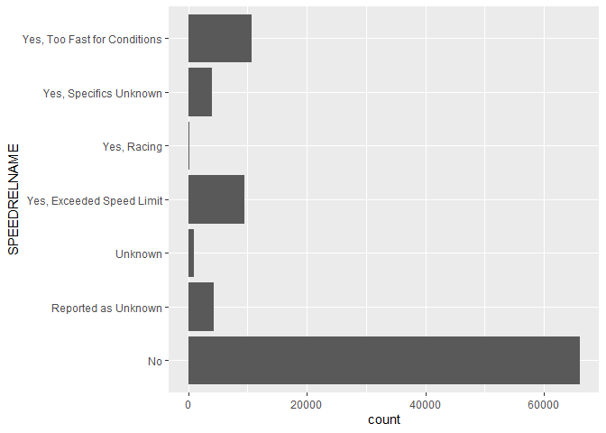
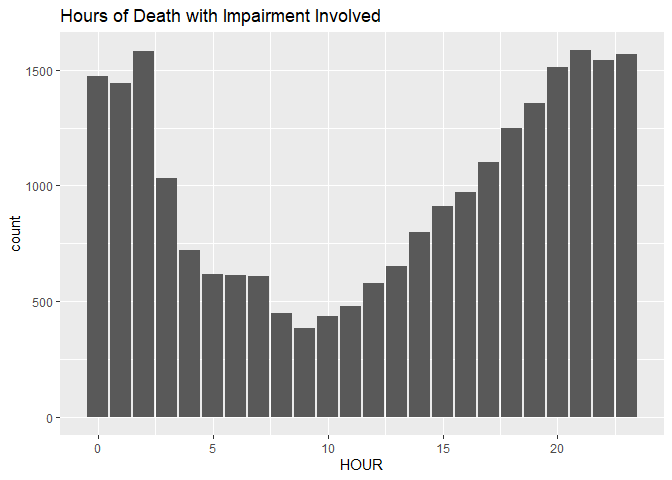
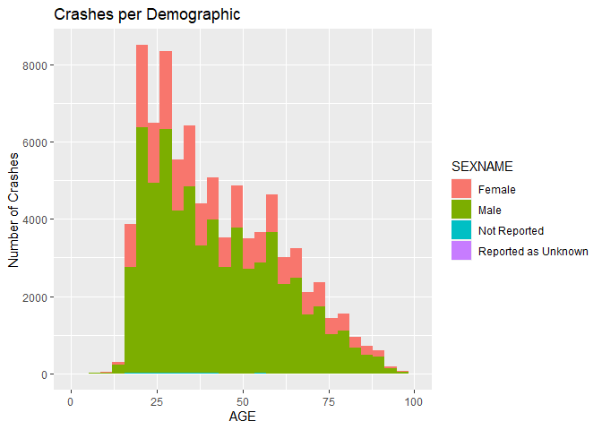
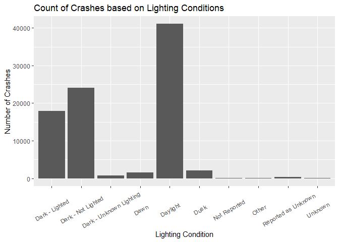

# Final Project DS202

#### Marissa Baietto, Ryan Dorle, Braeden Collings

## Introduction (ANYONE CAN FIX THIS SECTION TO MAKE IT CLEANER)

- Describe topic: The goal of the project is to explore multiple
  datasets to better understand fatal vehicle crashes. Understanding
  this topic better can lead to increased awareness, targeted policing
  efforts, and identification of common trends for accidents.
  Ultimately, the goal is the circumstances in which individuals get
  into vehicular accidents, and how to avoid fatal crashes. We combined
  multiple data sets to create a large data set with vehicle crashes
  resulting in deaths from the years 2017-2021. We included many
  variables that we plan to investigate for various reasons to attempt
  to find trends or correlations.
- Why topic is important: Fatal car crashes are a part of daily life due
  to the high volume of drivers in the United States. We want to
  investigate the data of multiple variables to see if there are trends
  that tend to cause deaths or the opposite. With the discovery of
  trends or common occurrence the knowledge can be used to help citizens
  as well as law enforcement to create better safety on the roads.
  Whenever we have the ability to travel safer in everyday
  transportation it is important to take the necessary steps to make it
  as safe as possible and that is our goal with this project.
- Research question In pursuit of the stated goal, we will explore the
  following questions:

1.  Does impairment affect fatality in crashes overall? When are
    impaired crashes most likely?

2.  What regions of the United States have the most fatal crashes? What
    conditions are present in those regions?

3.  How does the demographics of the driver affect crashes? Are changes
    based on occupants more prevalent for younger drivers?

4.  Are crashes affected by lighting and road conditions? How so, and
    what conditions are most impact?

5.  When are crashes most likely? Are there any seasonal effects, and
    are night crashes more likely than in the morning or afternoon?

6.  How is speeding related to the number of fatalities? Are younger
    drivers more prone to speeding? Is higher speeding limits associated
    with more fatalities?

These are the main questions we are looking to answer through the
completion of this project. With the findings we will be able to draw
different conclusions on fatal car crashes throughout the United States.

## Data

### Structure

The link to the dataset is
<https://www.nhtsa.gov/file-downloads?p=nhtsa/downloads/FARS/> . The
NHTSA website contains a zip file containing the FARS report for every
year between 1975 and 2021. Each zip file contains 33 different csv
files for various aspects of a vehicle crash - data on the accident
itself, the vehicles driven, damage to the vehicles, the persons in each
vehicle, etc. The number of variables in these csv files ranges from 6
to 81+, and there are over 40,000 rows for each csv.

In creating a cohesive dataset, we first chose to analyze the years
2017-2021. The variables reported and interpretations for the values of
each variable have been through multiple changes over the years, so
selecting a recent time period ensures that the reporting systems are
nearly the same for each year. In addition, having a 5 year time frame
to analyze allows us to see changes over time, and keeps the dataset
from being so large that it is unmanageable.

Utilizing all of the csvs would have introduced too many variables, so
we selected the csvs named “accident”, “person”, and “vehicle”.
“Accident” gives information on the time, place, and general aspects of
the accident such as the number of fatalities and the weather and light
conditions. “Person” contains data on the age and sex of each person in
the crash, as well as other variables such as whether the person
involved was drinking or under the influence of drugs at the time of the
crash. Lastly, “vehicle” gives facts regarding the number of occupants
in the vehicle, the state listed on the driver’s license, what the speed
limit was and whether the driver was speeding, and whether the accident
was a hit and run.

The “accident” csv has separate rows for each case, while the “person”
csv has separate rows for each person involved in the crash, both
passengers and drivers, and the “vehicle” csv has separate rows for each
vehicle involved in the crash. As seen in the code, we made decisions to
limit the number of rows for each accident to ensure that the dataset
would not be too large.

### Cleaning

First, we read in the 3 types of csv files for the years 2017 - 2021.

``` r
accident_2017 <- read_csv("2017.csv")
accident_2018 <- read_csv("2018.csv")
accident_2019 <- read_csv("2019.csv")
accident_2020 <- read_csv("2020.csv")
accident_2021 <- read_csv("2021.csv")

person_2017 <- read_csv("2017_person.csv")
person_2018 <- read_csv("2018_person.csv")
person_2019 <- read_csv("2019_person.csv")
person_2020 <- read_csv("2020_person.csv")
person_2021 <- read_csv("2021_person.csv")

vehicle_2017 <- read_csv("2017_vehicle.csv")
vehicle_2018 <- read_csv("2018_vehicle.csv")
vehicle_2019 <- read_csv("2019_vehicle.csv")
vehicle_2020 <- read_csv("2020_vehicle.csv")
vehicle_2021 <- read_csv("2021_vehicle.csv")
```

Originally, the “person” csv files were 24.1 MB large for each year.
GitHub’s size limit for uploading files to the reposirory is 24MB, which
meant that we could not upload the “person” csvs to GitHub. To overcome
this problem, we created a separate R Script and slimmed the csv files
there. We did so by opening the csv files for each year and filtering
such that (PER_NO == 1), meaning that only the driver is included in the
csv files. This brought the size of the csv down to meet the limits. We
then saved the new csv files as “(YEAR)\_person.csv”, and uploaded the
modified csv files to this project report.

Then, we selected the variables we needed for each type of csv.

``` r
accident_2017 <- accident_2017 %>% select(STATENAME, ST_CASE, MONTH, DAY, YEAR, HOUR, MINUTE, RUR_URBNAME, LATITUDE, LONGITUD, LGT_CONDNAME, WEATHER1NAME, FATALS, DRUNK_DR, DAY_WEEK)
accident_2018 <- accident_2018 %>% select(STATENAME, ST_CASE, MONTH, DAY, YEAR, HOUR, MINUTE, RUR_URBNAME, LATITUDE, LONGITUD, LGT_CONDNAME, WEATHER1NAME, FATALS, DRUNK_DR, DAY_WEEK)
accident_2019 <- accident_2019 %>% select(STATENAME, ST_CASE, MONTH, DAY, YEAR, HOUR, MINUTE, RUR_URBNAME, LATITUDE, LONGITUD, LGT_CONDNAME, WEATHER1NAME, FATALS, DRUNK_DR, DAY_WEEK)
accident_2020 <- accident_2020 %>% select(STATENAME, ST_CASE, MONTH, DAY, YEAR, HOUR, MINUTE, RUR_URBNAME, LATITUDE, LONGITUD, LGT_CONDNAME, WEATHERNAME, FATALS, DRUNK_DR, DAY_WEEK)
accident_2021 <- accident_2021 %>% select(STATENAME, ST_CASE, MONTH, DAY, YEAR, HOUR, MINUTE, RUR_URBNAME, LATITUDE, LONGITUD, LGT_CONDNAME, WEATHERNAME, FATALS, DAY_WEEK)

person_2017 <- person_2017 %>% select(AGE, SEXNAME, DRINKINGNAME, DRUGSNAME, LAG_HRSNAME, ST_CASE, VEH_NO, PER_NO)
person_2018 <- person_2018 %>% select(AGE, SEXNAME, DRINKINGNAME, DRUGSNAME, LAG_HRSNAME, ST_CASE, VEH_NO, PER_NO)
person_2019 <- person_2019 %>% select(AGE, SEXNAME, DRINKINGNAME, DRUGSNAME, LAG_HRSNAME, ST_CASE, VEH_NO, PER_NO)
person_2020 <- person_2020 %>% select(AGE, SEXNAME, DRINKINGNAME, DRUGSNAME, LAG_HRSNAME, ST_CASE, VEH_NO, PER_NO)
person_2021 <- person_2021 %>% select(AGE, SEXNAME, DRINKINGNAME, DRUGSNAME, LAG_HRSNAME, ST_CASE, VEH_NO, PER_NO)
```

There were 2 disreptencies between the years in the accident files.
First, “accident_2021” did not have a variable for “DRUNK_DR”. Second,
the naming of the variable containing information on the weather changed
in 2020 and 2021 from “WEATHER1NAME” to “WEATHERNAME”. (THIS WAS A GRAPH
THAT DIDN”T MAKE SENSE IN RYAN”S SECTION) We accounted for the
disreptency in weather by creating a duplicate variable named
“WEATHERNAME” in the 2017,2018,2019 dataframes and deleting the
“WEATHER1NAME” variables in those same dataframes.

``` r
accident_2017$WEATHERNAME <- accident_2017$WEATHER1NAME
accident_2018$WEATHERNAME <- accident_2018$WEATHER1NAME
accident_2019$WEATHERNAME <- accident_2019$WEATHER1NAME

accident_2017 <- accident_2017 %>% select(-WEATHER1NAME)
accident_2018 <- accident_2018 %>% select(-WEATHER1NAME)
accident_2019 <- accident_2019 %>% select(-WEATHER1NAME)
```

To enable us to merge the datasets for each year, we created a “YEAR”
variable for the “person” and “vehicle” datasets.

``` r
person_2017$YEAR = 2017
person_2018$YEAR = 2018
person_2019$YEAR = 2019
person_2020$YEAR = 2020
person_2021$YEAR = 2021

vehicle_2017$YEAR = 2017
vehicle_2018$YEAR = 2018
vehicle_2019$YEAR = 2019
vehicle_2020$YEAR = 2020
vehicle_2021$YEAR = 2021
```

To merge the datasets together, we first created 5 dataframes for each
year, with each dataframe being a merge of the year’s accident, person,
and year dataframes. This was performed with a left_join with “accident”
as the main dataframe. After “accident” and “person” were merged by year
and st_case.

ST_CASE is a unique identifier for each accident that occured in the
state. Vehicles and persons involved in the same crash have identical
ST_CASE numbers. For each state, ST_CASE starts with a new number, but
has the same format. For example, Alabama’s ST_CASE numbers are in the
10,000s, Alaska’s ST_CASE numbers are in the 20,000s, and so on with the
states in order alphabetically. ST_CASE numbers reset each year, meaning
that the first case in Alabama in 2017, 2018, 2019, 2020, and 2021 have
the ST_CASE number 10001.

We merged the new dataframes with the vehicle dataframes for each year
by performing a left merge by year, st_case, and veh_no. VEH_NO is a
unique identifier for each vehicle involved in the crash, and it resets
to 1 for each new accident. Merging on VEH_No ensured that we were
matching each driver to the vehicle they drove, as the “person” file
included the vehicle number as well for each individual.

``` r
df_2017 <- left_join(accident_2017, person_2017, by=c('YEAR', 'ST_CASE'))
df_2018 <- left_join(accident_2018, person_2018, by=c('YEAR', 'ST_CASE'))
df_2019 <- left_join(accident_2019, person_2019, by=c('YEAR', 'ST_CASE'))
df_2020 <- left_join(accident_2020, person_2020, by=c('YEAR', 'ST_CASE'))
df_2021 <- left_join(accident_2021, person_2021, by=c('YEAR', 'ST_CASE'))


df_2017 <- left_join(df_2017, vehicle_2017, by=c('YEAR', 'ST_CASE', 'VEH_NO'))
df_2018 <- left_join(df_2018, vehicle_2018, by=c('YEAR', 'ST_CASE', 'VEH_NO'))
df_2019 <- left_join(df_2019, vehicle_2019, by=c('YEAR', 'ST_CASE', 'VEH_NO'))
df_2020 <- left_join(df_2020, vehicle_2020, by=c('YEAR', 'ST_CASE', 'VEH_NO'))
df_2021 <- left_join(df_2021, vehicle_2021, by=c('YEAR', 'ST_CASE', 'VEH_NO'))
```

To merge all of the years together, we used the bind_rows function and
put the years in order from 2017 to 2021. Again, we confronted the
problem that the file was too large to upload to GitHub. So, we selected
one vehicle per crash, by filtering such that VEH_NO == 1. There is
always a vehicle with number equal to 1 for each accident because the
first vehicle listed for each accident has a vehicle number equal to
one. We also only chose the even state case numbers. This ensured that
each state would have the same proportion of accidents that they had in
the original file, and choosing odd state case numbers gave us a smaller
random sample from the original dataset.

``` r
df <- bind_rows(df_2017, df_2018,df_2019,df_2020,df_2021)
df1 <- df %>% group_by(STATENAME, YEAR) %>% filter(VEH_NO == 1 & ST_CASE %% 2 == 0) #add & ST_CASE %% 2 == 0
```

We noticed that there were 2 strange columns in the final dataframe
named ‘…22’ and ‘…21’. We believe that these were created when we joined
the ‘accident’, ‘person’, and ‘vehicle’ datasets, as there were so many
variables that R was not able to show them all when we viewed the merged
datasets. We took these columns out, as they had no value to our
analysis.

``` r
colnames(df1)
```

    ##  [1] "STATENAME"    "ST_CASE"      "MONTH"        "DAY"          "YEAR"        
    ##  [6] "HOUR"         "MINUTE"       "RUR_URBNAME"  "LATITUDE"     "LONGITUD"    
    ## [11] "LGT_CONDNAME" "FATALS"       "DRUNK_DR"     "DAY_WEEK"     "WEATHERNAME" 
    ## [16] "AGE"          "SEXNAME"      "DRINKINGNAME" "DRUGSNAME"    "LAG_HRSNAME" 
    ## [21] "VEH_NO"       "PER_NO"       "...23"        "HIT_RUNNAME"  "NUMOCCSNAME" 
    ## [26] "L_STATENAME"  "SPEEDRELNAME" "VSPD_LIM"     "...22"

``` r
df1 <- df1 %>% select(-one_of('...22', '...21', '...23'))
```

To ease running the code, we saved the final dataset to “master.csv” so
that we could then only run the line importing “master.csv” rather than
run the code above repeatedly.

``` r
write.csv(df1, 'master.csv')
```

### Variables

- STATENAME: The state the fatal crash occured in
- WEATHERNAME: The type of weather outside at the time and location of
  the crash.
- VEH_NO: Vehicle Number, a number assigned to each vehicle in the
  crash.
- PER_NO: Person Number, A unique number assigned to any person involved
  in the crash.
- DRUGSNAME: Were there drugs involved in the crash if so the name of
  the drug.
- DRINKINGNAME: Was drinking involved in the crash if so what alcohol.  
- SEXNAME: The gender of people related to the crash.
- AGE: Age of people in the crash.
- DRUNK_DR: Drinking Drivers, The number of drinking drivers involved in
  the crash.
- FATALS: The number of fatalities in the crash.
- WEATHER1NAME: Atmospheric conditions at the time of the crash.
- LGT_CONDNAME: What was the lighting condition at the time of the
  crash.
- LATITUDE: The location of the crash using global positioning (East and
  West).
- LONGITUD: The location of the crash using global positioning (North
  and South).
- RUR_URBNAME: Land Use, the segment of the traffic way on which the
  crash occurred based on urbanized areas.
- HOUR: The time of the crash in hours.
- MINUTE: The time of the crash in minutes.
- MONTH: The month the crash occurred in.
- DAY: The day the crash occurred on.
- YEAR: The year in which the crash happened.
- ST_CASE: Unique case number assigned to each crash.
- HIT_RUN: Whether the crash was a hit and run.
- NUMOCCS: Number of occupants in the vehicle.
- L_STATE: The state listed on the driver’s license.
- SPEEDREL: Whether the crash was speeding related.
- VSPD_LIM: What the speeding limit was.

## Methods

- Methods utilized, if used

## Results

- All results and graphics
  - For each graphic,
    - Motivation for making the graphic
    - Insights obtained from the graphics
    - Necessary explanations
  - Formatting
    - Axis Labels, Title, Captions, Color Scheme if necessary
    - Each graphic illustrates one point
    - Make color scheme cohesive
    - Avoid repetition
- List trials and errors
  - Critical of findings
  - Multiple approaches and techniques used to verify unintuitive
    results
- Any additional research used to help understand/explain findings

``` r
library(readr)
library(tidyverse)
master <- read_csv('master.csv')
head(master)
```

    ## # A tibble: 6 × 28
    ##    ...1 STATENAME ST_CASE MONTH   DAY  YEAR  HOUR MINUTE RUR_URBNAME LATITUDE
    ##   <dbl> <chr>       <dbl> <dbl> <dbl> <dbl> <dbl>  <dbl> <chr>          <dbl>
    ## 1     1 Alabama     10002     2    14  2017    14     59 Urban           34.7
    ## 2     2 Alabama     10004     1     1  2017    16     55 Urban           33.5
    ## 3     3 Alabama     10006     1     6  2017    18     40 Rural           34.4
    ## 4     4 Alabama     10008     1    11  2017    16     50 Rural           31.0
    ## 5     5 Alabama     10010     1    14  2017     4      0 Urban           33.7
    ## 6     6 Alabama     10012     1    19  2017    21     50 Rural           32.1
    ## # ℹ 18 more variables: LONGITUD <dbl>, LGT_CONDNAME <chr>, FATALS <dbl>,
    ## #   DRUNK_DR <dbl>, DAY_WEEK <dbl>, WEATHERNAME <chr>, AGE <dbl>,
    ## #   SEXNAME <chr>, DRINKINGNAME <chr>, DRUGSNAME <chr>, LAG_HRSNAME <chr>,
    ## #   VEH_NO <dbl>, PER_NO <dbl>, HIT_RUNNAME <chr>, NUMOCCSNAME <chr>,
    ## #   L_STATENAME <chr>, SPEEDRELNAME <chr>, VSPD_LIM <dbl>

### When are crashes most likely? Are there any seasonal effects, and are night crashes more likely than in the morning or afternoon?

#### Year

``` r
master %>% group_by(YEAR) %>% summarise(Fatal_Accidents = n()) %>% ungroup() %>% ggplot(aes(x = YEAR, y = Fatal_Accidents)) + geom_line() + ggtitle("Number of Fatal Accidents Over Last 5 Years") + ylab("Fatal Accidents") + xlab("Year")+ ylim(0,23000)
```

<!-- -->

This graphic shows the changes in the number of fatal motor vehicle
crashes over the last 5 years. We wanted to see if the number of fatal
car crashes has been increasing, decreasing, or remaining constant over
time. From this graph, we can see that the number of fatal car crashes
decreased slightly from 2017 to 2019, but has been on an upward trend
from 2019 to 2021. This does not encompass all of the fatal car crashes
over time, as we are only looking at even cases, but we can still
conclude that the fatal car crashes has been increasing in recent years,
as the actual statistics are almost exactly double than what the graph
depicts.

#### Month and Season

``` r
master <- master %>% 

  mutate(Season = case_when( 

    MONTH %in% c("3","4","5") ~ "Spring", 

    MONTH %in% c("6","7","8") ~ "Summer", 

    MONTH %in% c("9","10","11") ~ "Autumn", 

    MONTH %in% c("12","1","2") ~ "Winter", 

    TRUE ~ "Other" 

  ))
```

The above code was used to pair each month with the appropriate season.
Information from almanac.com was used to identify the meteorological
start and end dates of each season.

``` r
master %>% ggplot(aes(x = MONTH, weight = FATALS, fill = Season)) + geom_bar() + scale_x_discrete(limits = c("January","February","March","April","May","June","July","August","September","October","November","December"))+
  theme(axis.text.x = element_text(angle=45, vjust=1, hjust=1)) + ylab("Fatalities") + ggtitle("Fatalities by Month and Season")
```

<!-- -->

This graph was created to see if car crashes are more prevalent in
winter months, than in the summer. We predicted that car crashes would
increase in the late autumn and winter months due to traveling for
Thanksgiving and Christmas, as well as due to the increasing chances of
driving in snow and other hazardous conditions in cold months. Instead,
this graph depicts the opposite of our hypothesis: the most car crashes
occur in the summer and early autumn. Since our analysis shows the
opposite of our expectations, we went to the internet to see if other
websites had found the same results. Multiple websites and reports
affirmed our analysis, with one website, jcdelaw.com, inferring that the
increased fatal accidents are caused by factors such as road
construction, tourism, heat-caused impaired driving, and increased
drinking and driving.

#### Month and Day

``` r
master %>% group_by(MONTH) %>% summarise(count = sum(FATALS)) %>% arrange(desc(count))
```

    ## # A tibble: 12 × 2
    ##    MONTH count
    ##    <dbl> <dbl>
    ##  1    10  8924
    ##  2     9  8898
    ##  3     7  8848
    ##  4     8  8787
    ##  5     6  8635
    ##  6     5  8194
    ##  7    11  8116
    ##  8    12  7875
    ##  9     4  7162
    ## 10     3  7110
    ## 11     1  6979
    ## 12     2  6262

The above code creates a list of the months in order of most to least
fatal accidents. This list was then applied to the graph below for its
fill.

``` r
farb<-c("#c91e1e","#c80028","#ce0053","#d3007f","#d900ae","#dd00de","#b500e4", "#8a00e9","#6900d9","#5700e7","#4100f3", "#1e00ff")
plot_names <- c('1' = "January",
                '2' = "February",
                '3' = "March",
                '4' = "April",
                '5' = "May",
                '6' = "June",
                '7' = "July",
                '8' = "August",
                '9' = "September",
                '10' = "October",
                '11' = "November",
                '12' = "December")

highlight_df <- master %>% filter((MONTH == 1 & DAY == 1) | (MONTH == 2 & DAY == 2) | (MONTH == 2 & DAY == 29) | (MONTH == 7 & DAY == 4) | (MONTH == 10 & DAY == 31) | (MONTH == 11 & (DAY == 23 | DAY == 22 | DAY == 28 | DAY == 26 | DAY == 25)) | (MONTH == 12 & DAY == 25))


master %>% group_by(DAY) %>% ggplot(aes(x = DAY, weight = FATALS)) + geom_bar(aes(fill = factor(MONTH, levels = c("10","7","8","6","9","5","11","12","4","3","1","2")))) +facet_wrap(~MONTH, labeller = as_labeller(plot_names)) + theme(legend.position="bottom") + scale_fill_manual(values= farb)+geom_bar(data=highlight_df, fill='green') + theme( legend.position="right")+labs(fill='Monthly Fatalities') + ylab("Fatalities") + ggtitle("Fatalities by Day and Month")
```

<!-- -->

The purpose of the above graph is to identify trends in fatal accidents
within each month. Red depicts months with the most number of fatal
accidents, and blue depicts months with the least number of fatal
accidents. We split the data into months so that we could identify
trends in holidays and other periods that we thought would have
interesting patterns. The green bars are holidays or special periods,
such as New Years Day, Valentines Day, Halloween, Thanksgiving week, and
Christmas day.

Originally, this graph showed high fatalities in January and February,
but little to no fatalities for rest of the year, with almost none in
November and December. We knew that this could not be correct, as it was
impossible for there to be no fatalities in December. This led us to the
finding that we mistakenly skewed the data when originally downscaling
the dataset. At first, we filtered the final dataframe such that we were
selecting the first 500 cases for every state and year pair. It turned
out that the state case numbers were created in chronological order,
with the smallest case numbers being in January and the largest in
December. To fix this, we changed the filter to select only the even
numbered state cases. This way, we would be getting a random sample of
the cases with all of the months having a representative proportion of
cases.

It is interesting to note that some of the holidays are immediately
apparent, such as New Years Day being the highest datapoint in January,
while Valentines Day does not stand out from the rest of February. The
last day in February, which is highlighted green, is February 29th,
which is Leap Day. Since leap years come only every 4 years, our dataset
has one leap year: 2020. This is why the data point is significantly
lower than the rest of the year. Surprisingly, July 3rd and July 4th are
the top highest days in July, with the third being higher than July 4th.
This may be due to traveling to see family. While Halloween has around
250 deaths, it is not significantly different than the rest of October,
as October was the month with the most fatal traffic accidents. Since
Thanksgiving day changes every year, we highlighted each separate
Thanksgiving day from 2017 to 2021. Since the day Thanksgiving occurred
on was different for every year, it is difficult to see the exact affect
Thanksgiving has on fatal traffic accidents. Yet, the Thanksgiving days
in 2018 and 2018 appear to be higher than the rest in terms of fatality.
Lastly, there is a drop-off from around 3 days before Christmas to two
days after Christmas. The day after Christmas may be lower due to
decreased travelling.

#### Weekday

``` r
master %>% group_by(DAY_WEEK) %>% summarize(num = sum(FATALS))
```

    ## # A tibble: 7 × 2
    ##   DAY_WEEK   num
    ##      <dbl> <dbl>
    ## 1        1 14976
    ## 2        2 12288
    ## 3        3 11968
    ## 4        4 11946
    ## 5        5 12736
    ## 6        6 15184
    ## 7        7 16692

``` r
master %>% ggplot(aes(x = as.factor(DAY_WEEK), weight = FATALS)) + geom_bar() + scale_x_discrete(
                      labels=c("Sunday","Monday", "Tuesday", "Wednesday","Thursday","Friday", "Saturday")) + xlab("Weekday") + ylab("Fatalities") + ggtitle("Fatalities by Weekday")
```

<!-- -->

We created the bar chart showing fatalities for each day of the week to
determine how fatal car accidents fluctuate throughout the week. We
predicted that the maximum would be on Friday, and that we would see a
positive trend of fatalities as the week moves from Monday to Friday.
Surprisingly, Friday and Sunday have similar numbers of fatalities.
Saturday has the most fatalities, while Monday, Tuesday, Wednesday, and
Thursday have no discernible pattern among themselves. Saturday is
significantly higher than Monday through Thursday, as well as having
almost 1,000 more fatalities than Friday or Saturday.

#### Hour

``` r
master %>% filter(HOUR <= 24) %>% ggplot(aes(x = as.factor(HOUR), weight = FATALS)) + geom_bar() + ylab("Fatalities") + ggtitle("Fatalities by Hour") + xlab("HOUR")
```

<!-- -->

Lastly, we created a histogram showing the number of fatalities per
hour. We were interested in whether more fatal car crashes occur at
night. In this graph, HOUR 0 is midnight, and HOUR 23 is 11pm, as the
dataset uses military time. There was an outlier that had HOUR equal to
99. Upon checking the manual, we saw that this meant that the hour was
unknown, so we removed these observations from the graph. There is an
increase in fatalities from 8am to 9pm, and then a decrease in
fatalities from 10pm to 4am. The majority of the fatalities occur
between 3pm and 9pm, which may be due to people driving home from school
or work, or heading out to dinner or other nightlife activities. There
is an interesting increase in fatalities between 5am and 7am, which
could be the result of adults headed to work or dropping their children
off at school.

### How is speeding related to the number of fatalities? Are younger drivers more prone to speeding? Is higher speeding limits associated with more fatalities?

#### Speeding

``` r
master %>% ggplot(aes(x = SPEEDRELNAME, weight = FATALS)) + geom_bar() + coord_flip()
```

<!-- -->

``` r
master <- master %>% mutate(
  WASSPEEDING = case_when(
    SPEEDRELNAME %in% c("Yes, Specifics Unknown","Yes, Too Fast for Conditions","Yes, Racing","Yes, Exceeded Speed Limit") ~ "Yes",
    SPEEDRELNAME %in% c("No") ~ "No",
    TRUE ~ "Unknown"
  ))
```

``` r
master %>% ggplot(aes(x = WASSPEEDING, weight = FATALS)) + geom_bar() + ggtitle("Distribution of Speeding Behavior (Condensed)") + xlab("Driver Was Speeding") + ylab("Fatalities")
```

<!-- -->

``` r
master %>% group_by((WASSPEEDING)) %>% mutate(num_cases = sum(VEH_NO)) %>% ungroup() %>% ggplot(aes(x = WASSPEEDING, weight = FATALS/num_cases)) + geom_bar() + ggtitle("Distribution of Speeding Behavior with Fatality Rate") + xlab("Driver Was Speeding") + ylab("Fatality Rate")
```

<!-- -->

#### Speeding and Weekday

``` r
master %>% ggplot(aes(x = as.factor(DAY_WEEK), weight = FATALS, fill=WASSPEEDING)) + geom_bar() + scale_x_discrete(
                      labels=c("Sunday","Monday", "Tuesday", "Wednesday","Thursday","Friday", "Saturday")) + xlab("Weekday") + ylab("Fatalities") + ggtitle("Fatalities by Weekday")
```

<!-- -->

#### Speeding and Age

``` r
master %>% filter(AGE < 900) %>% filter(AGE == min(AGE))
```

    ## # A tibble: 1 × 30
    ##    ...1 STATENAME ST_CASE MONTH   DAY  YEAR  HOUR MINUTE RUR_URBNAME LATITUDE
    ##   <dbl> <chr>       <dbl> <dbl> <dbl> <dbl> <dbl>  <dbl> <chr>          <dbl>
    ## 1 49382 Texas      483296    12    25  2019    10     15 Rural           31.0
    ## # ℹ 20 more variables: LONGITUD <dbl>, LGT_CONDNAME <chr>, FATALS <dbl>,
    ## #   DRUNK_DR <dbl>, DAY_WEEK <dbl>, WEATHERNAME <chr>, AGE <dbl>,
    ## #   SEXNAME <chr>, DRINKINGNAME <chr>, DRUGSNAME <chr>, LAG_HRSNAME <chr>,
    ## #   VEH_NO <dbl>, PER_NO <dbl>, HIT_RUNNAME <chr>, NUMOCCSNAME <chr>,
    ## #   L_STATENAME <chr>, SPEEDRELNAME <chr>, VSPD_LIM <dbl>, Season <chr>,
    ## #   WASSPEEDING <chr>

``` r
master %>% ggplot(aes(x=AGE, fill = WASSPEEDING, weight = FATALS)) + geom_histogram() + scale_x_continuous(name="AGE", limits=c(0, 100)) + xlab("Age - Colored by Sex") + ylab("Number of Crashes") + ggtitle("Crashes per Demographic")
```

    ## `stat_bin()` using `bins = 30`. Pick better value with `binwidth`.

    ## Warning: Removed 2779 rows containing non-finite values (`stat_bin()`).

    ## Warning: Removed 6 rows containing missing values (`geom_bar()`).

<!-- -->

#### Speedlimits

``` r
master %>% ggplot(aes(x = as.factor(VSPD_LIM), weight = FATALS)) + geom_bar()
```

<!-- -->

### Does impairment affect fatality in crashes overall? When are impaired crashes most likely?

``` r
master$ImpairmentAlcohol <- ifelse(master$DRINKINGNAME %in% c("No (Alcohol Not Involved)", "Unknown (Police Reported)", "Not Reported", "Reported as Unknown"), FALSE, TRUE)

master$ImpairmentDrugs <- ifelse(master$DRUGSNAME %in% c("No (drugs not involved)", "Unknown (Police Reported)", "Not Reported", "Reported as Unknown"), FALSE, TRUE)

master <- master %>% mutate(
  Impairment = as.logical(pmax(ImpairmentDrugs, ImpairmentAlcohol))
)

master %>% ggplot(aes(x = Impairment)) + geom_bar() + ggtitle("Was the Deceased party Impaired")
```

<!-- -->

A graph just to get an idea of what amount of fatal crashes had a form
of drugs or alcohol in there system at the time of the crash. We see
that just over 27% of fatal crashes over 2017-2021 had a form of
impairment involved.

``` r
master %>% filter(Impairment == TRUE) %>%
  filter(HOUR <=24) %>% ggplot(aes(x = HOUR), fill = factor(MONTH)) + geom_bar(bins = 24) + ggtitle("Hours of Death with Impairment Involved")
```

    ## Warning in geom_bar(bins = 24): Ignoring unknown parameters: `bins`

<!-- -->

A graph to look at what hours of the day had the highest rate of
fatalities when impairment was involved. We can see that at the times
from 9pm - 2am where the highest rates.

### What regions of the United States have the most fatal crashes? What conditions are present in those regions?

``` r
master <- master %>% 

  mutate(Region = case_when( 

    STATENAME %in% c("Connecticut", "Maine", "Massachusetts", "New Hampshire", "Rhode Island", "Vermont", "District of Columbia", "New Jersey", "New York", "Pennsylvania") ~ "Northeast", 

    STATENAME %in% c("Illinois", "Indiana", "Iowa", "Kansas", "Michigan", "Minnesota", "Missouri", "Nebraska", "North Dakota", "Ohio", "South Dakota", "Wisconsin") ~ "Midwest", 

    STATENAME %in% c("Alabama", "Arkansas", "Delaware", "Florida", "Georgia", "Kentucky", "Louisiana", "Maryland", "Mississippi", "North Carolina", "Oklahoma", "South Carolina", "Tennessee", "Texas", "Virginia", "West Virginia") ~ "South", 

    STATENAME %in% c("Alaska", "Arizona", "California", "Colorado", "Hawaii", "Idaho", "Montana", "Nevada", "New Mexico", "Oregon", "Utah", "Washington", "Wyoming") ~ "West", 

    TRUE ~ "Other" 

  )) 

master %>% ggplot(aes(x = Region, fill = Impairment)) + geom_bar() + ggtitle("Region of Death")
```

<!-- -->

This graph gives us a chance to see what regions had the most deaths, as
well as a color change for whether or not impairment was involved in the
crash.

``` r
master %>% ggplot(aes(x = Region, fill = RUR_URBNAME)) + geom_bar() + ggtitle("Population Density")
```

<!-- -->

We can bring in another variable to see if the population density of a
region plays a roll in fatal crashes and we find that it does not.

``` r
master %>% ggplot(aes(x = Impairment, fill = RUR_URBNAME)) + geom_bar() + ggtitle("Population Density & Impairment")
```

<!-- -->

Just another graph for reference to see if deaths due to impairment are
affected by population denstity and again we find that they are not.

### How does the demographics of the driver affect crashes? Are changes based on occupants more prevalent for younger drivers?

``` r
master %>% ggplot(aes(x=AGE, fill = SEXNAME)) + geom_histogram()
```

    ## `stat_bin()` using `bins = 30`. Pick better value with `binwidth`.

<!-- -->

Similar to the hour, there is a stange outlier that we will eliminate

``` r
master %>% ggplot(aes(x=AGE, fill = SEXNAME)) + geom_histogram() + scale_x_continuous(name="AGE", limits=c(0, 100)) + xlab("Age - Colored by Sex") + ylab("Number of Crashes") + ggtitle("Crashes per Demographic")
```

    ## `stat_bin()` using `bins = 30`. Pick better value with `binwidth`.

    ## Warning: Removed 2779 rows containing non-finite values (`stat_bin()`).

    ## Warning: Removed 8 rows containing missing values (`geom_bar()`).

<!-- -->

This data clearly shows that driver age and sex are largely impactful in
fatal car crashes.

``` r
master %>% ggplot(aes(x=LGT_CONDNAME)) + geom_bar() + theme(axis.text.x = element_text(angle = 30, vjust = 0.5)) + ggtitle("Count of Crashes based on Lighting Conditions") + ylab("Number of Crashes") + xlab("Lighting Condition")
```

<!-- -->

Looking at the time of day, it makes sense that daylight would have
significantly more crashes than dark. It is important to not that when
dark, there are significantly more when the area is not lighted.

``` r
master %>% ggplot(aes(y=STATENAME, fill = WEATHERNAME)) + geom_bar() + xlab("Number of Crashes") + ylab("State Name") + labs(fill = "Weather Condition") + ggtitle("Weather Conditions for each Crash per State")
```

<!-- -->

Looking at crashes per state, it is clear even in colder states, where
snow is common, clear or cloudy conditions are the most common
conditions for crashes

``` r
master %>% ggplot(aes(x=WEATHERNAME, fill = LGT_CONDNAME)) + geom_bar() + theme(axis.text.x = element_text(angle = 30, vjust = 0.5)) + ggtitle("Count of Crashes based on Weather Conditions") + ylab("Number of Crashes") + xlab("Weather Condition") + labs(fill = "Lighting Condition")
```

<!-- -->

This seemingly unimportant data suggests the conditions to be most
careful for are cloudy or clear days when the area is lighted.

## Conclusion

- Overall idea
- Interesting further questions
- Ideas for future research
